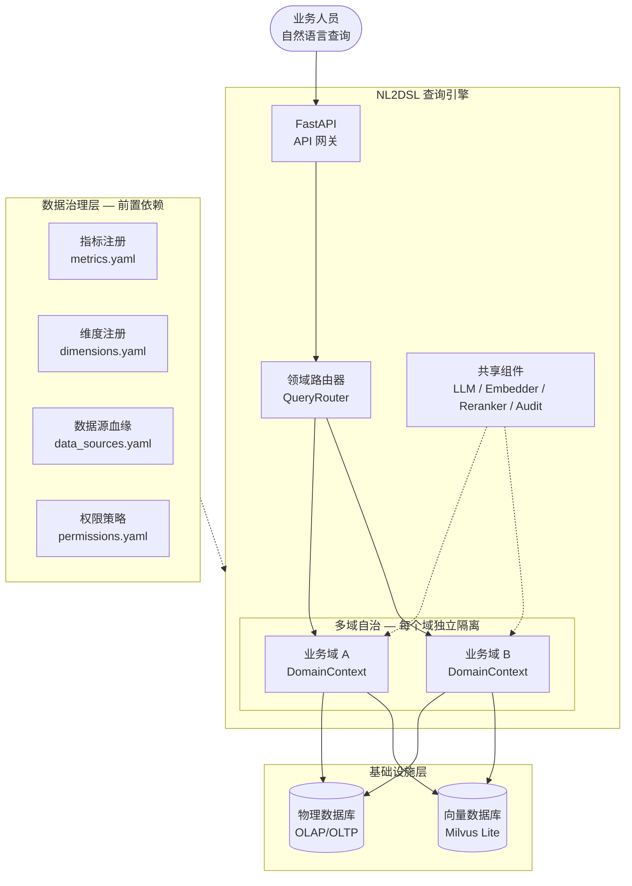
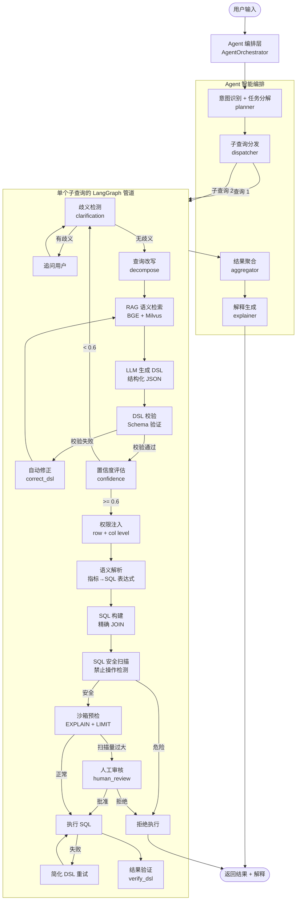

# NL2DSL — 自然语言语义查询层

> 让业务人员用自然语言直接查数，系统自动理解语义、校验口径、保障安全。

[](https://www.python.org/downloads/)
[](#)
[](https://opensource.org/licenses/MIT)

---

## 一句话定位

**NL2DSL 是一个面向数据治理的自然语言语义查询层。**

它不替代你的数据仓库或 BI 工具，而是在业务人员和数据库之间建立一个**语义层**：业务说"华东销售额"，系统自动理解成 `SUM(pay_amount) WHERE region_code='HD'`——同时保证口径一致、权限受控、全程可审计。

---

## 为什么需要语义查询层

企业的数据架构通常长这样：

```
业务人员 ──→ 提需求 ──→ 数据团队写 SQL ──→ 数据库
              ↑                              ↑
         排队等排期                      物理字段：pay_amt, region_cd
```

业务看不懂数据库里的 `pay_amt`、`region_cd`，数据团队疲于应付各种"帮我拉个数"。

NL2DSL 在这之间插入一个**语义层**：

```
业务人员 ──→ "查华东销售额" ──→ 语义层 ──→ 数据库
                                   ↑
                              销售额 = SUM(pay_amt)
                              华东 = region_cd='HD'
                              权限：只能看华东
                              审计：谁在查、查了什么
```

语义层的核心资产是**治理定义**——指标口径、维度编码、权限策略。NL2DSL 消费这些定义，把自然语言翻译成安全、可控的查询。

---

## 一分钟看懂效果

### 业务人员输入

```
查询华东地区销售额最高的 10 个产品
```

### NL2DSL 处理过程

```
自然语言
  → RAG 语义检索（"销售额"→sales_amount 指标，"华东"→region 维度）
  → LLM 生成 DSL（结构化 JSON，可校验）
  → 系统校验（sales_amount 是否注册？region 维度是否存在？）
  → 权限注入（用户 u001 只能看华东数据）
  → 语义解析（sales_amount → SUM(pay_amount)，华东 → 'HD'）
  → SQL 构建（按需 JOIN，只 JOIN 被引用的表）
  → 安全扫描 + 沙箱预检
  → 执行 → 返回结果
```

### 生成的 DSL（中间产物，可审计）

```json
{
  "metrics": [{"func": "sum", "field": "pay_amount", "alias": "sales_amount"}],
  "dimensions": ["product_name", "region"],
  "filters": {
    "op": "and",
    "children": [
      {"field": "region", "operator": "=", "value": "华东"},
      {"field": "order_date", "operator": "between", "value": ["2024-01-01", "2024-12-31"]}
    ]
  },
  "order_by": [{"field": "sales_amount", "direction": "desc"}],
  "limit": 10,
  "data_source": "orders",
  "time_field": "order_date",
  "time_range": ["2024-01-01", "2024-12-31"]
}
```

`filters` 支持**条件树**（`and`/`or`/`not` 嵌套），同时兼容旧版 flat list。支持操作符：`=`, `!=`, `>`, `<`, `>=`, `<=`, `between`, `in`, `like`, `is_null`。

### 执行的安全保障

| 检查点 | 作用 | 结果 |
|--------|------|------|
| DSL 校验 | 指标/维度是否已注册 | 未注册直接拦截 |
| 列级权限 | 是否访问敏感字段 | 越权拒绝 |
| 行级权限 | 自动注入租户/组织过滤 | 看不到别人的数据 |
| SQL 扫描 | 检测 DELETE/UNION/注释注入 | 危险操作拦截 |
| 沙箱预检 | EXPLAIN + LIMIT 预览 | 全表扫描告警 |

---

## 架构定位：数据治理的消费层



**图的阅读指南**：
- **实线箭头** = 数据流向（用户请求 → 引擎处理 → 数据库执行）
- **虚线箭头** = 依赖关系（引擎消费治理配置、共享组件被各域复用）
- **DomainContext** = 每个域的完整运行时（独立的 RAG、DSL 校验器、SQL 构建器、权限组件）
- 不同业务域的 `metrics.yaml` 彼此隔离，不会互相污染

**核心原则**：NL2DSL 不定义"什么是销售额"，只消费治理层已经定义好的 `sales_amount: SUM(pay_amount)`。就像 Tableau 消费数据仓库的度量定义一样。

### 与传统 NL2SQL 的区别

| | 传统 NL2SQL | NL2DSL |
|---|---|---|
| LLM 输出 | 自由文本 SQL | 结构化 JSON（DSL） |
| 可校验性 | 不可校验 | JSON Schema 校验 |
| 权限控制 | 事后拦截或无法干预 | DSL 层级注入过滤条件 |
| 安全可控 | SQL 注入风险高 | SQLAlchemy Core 参数化构建 |
| 数据治理依赖 | 无要求（直接查物理表） | **必须**有治理定义 |
| 多域支持 | 通常单域 | 自动发现多域配置 |

---

## 核心能力

### 1. 自然语言到治理化 SQL 的端到端管道

不是简单的问题→SQL 映射，而是一个 10+ 节点的 LangGraph 状态机，每个阶段都有纠错和回退：

| 阶段 | 作用 | 失败时的处理 |
|------|------|-------------|
| 歧义检测 | 缺少时间范围？指标歧义？ | **主动追问用户**，不瞎猜 |
| 查询改写 | "对比今年和去年"→按年分组+限定两年 | 复杂问题拆成可执行形式 |
| RAG 检索 | jieba 分词 + BGE 嵌入 + 重排序 | 定向补充知识后重新生成 |
| LLM 生成 DSL | 结构化 JSON，可校验 | 进入修正循环，最多 3 次 |
| 权限注入 | 行过滤 + 列控制自动写入 DSL | 越权直接拒绝 |
| SQL 构建 | SQLAlchemy Core 参数化生成 | 简化 DSL 后重试 |
| 安全扫描 | 拦截 DELETE/UNION/注释注入 | 危险操作直接拒绝 |
| 沙箱预检 | EXPLAIN 分析扫描量 | 超限→人工审核→放行或拒绝 |
| 结果验证 | 自检结果是否回答了原问题 | 告警（持续优化中） |

**效果**：业务人员说一句话，系统自动完成从意图理解到安全执行的全流程，零 SQL 门槛。

---

### 2. 多层安全防线（传统 NL2SQL 没有的能力）

传统 NL2SQL 把自由文本 SQL 直接交给数据库，权限和安全只能事后补救。NL2DSL 在四道闸门上逐层拦截：

```
用户输入
  → DSL 校验      [未注册的指标/维度？→ 拦截]
  → 权限注入      [越权访问敏感列？→ 拒绝]
  → SQL 扫描      [DELETE/UNION/注释注入？→ 拒绝]
  → 沙箱预检      [全表扫描风险？→ 人工审核]
  → 执行
```

**效果**：任何一道闸门未通过，查询都无法到达数据库。权限在 DSL 层级注入，不是 SQL 生成完再过滤。

---

### 3. 数据治理成果的消费层

NL2DSL 不定义"什么是销售额"，只消费治理层已经定义好的 `sales_amount: SUM(pay_amount)`。数据团队做的治理工作直接转化为自然语言查询能力：

| 治理成果 | 配置位置 | NL2DSL 如何消费 |
|----------|---------|----------------|
| 指标口径统一 | `metrics.yaml` | LLM 生成 DSL 时引用标准计算式 |
| 维度标准编码 | `dimensions.yaml` | "华东"自动映射为 `'HD'` |
| 数据权限分级 | `permissions.yaml` | 自动注入租户/组织过滤条件 |
| 敏感数据脱敏 | `permissions.yaml` | 越权访问敏感列直接拒绝 |
| 业务术语词典 | `terms.yaml` | "流水"→ `alias=gmv` |

**效果**：治理做得越完善，NL2DSL 的体验越好。不需要为自然语言查询重新建模。

---

### 4. Agentic 自修正（越用越准）

查询链路中嵌入 4 个智能决策节点，不是一次性生成 SQL 就完事：

- **clarification**：用户说"查下销售额"缺少时间范围 → 系统主动追问"请指定时间范围"
- **decompose**："对比今年和去年华东销售额" → 改写为"按年分组 + 限定 2024/2025 年 + 地区='华东'"
- **correct_dsl**：DSL 校验失败（比如引用了未注册的指标）→ LLM 决策检索关键词 → 定向 RAG 补充上下文 → 重新生成
- **verify_dsl**：执行完成后，LLM 自检"这个结果真的回答了用户的问题吗？"

**效果**：有完整的纠错闭环，不是"生成一次，对错随缘"。

---

### 5. 精确 JOIN 检测

不是所有查询都需要 JOIN 所有表。NL2DSL 分析 DSL 中引用的列，只 JOIN 实际需要的表：

```
传统做法（全量 JOIN）              NL2DSL（精确 JOIN）
────────────────────────────────────────────────────────
FROM orders                       FROM orders
JOIN t1 JOIN t2 JOIN t3           JOIN t2              ← 只引用了 t2 的列
     JOIN t4 JOIN t5
```

**效果**：某业务域 `orders` 数据源配置了 5 个 JOIN，平均查询从 3.8 个 JOIN 降到 0.5 个，71% 的查询不需要任何 JOIN。

---

### 6. 多域自治

一套 NL2DSL 实例同时服务多个业务团队，各域配置完全隔离：

```
configs/
  metrics.yaml              # 默认域
  biz_a_metrics.yaml        # 业务域 A
  biz_a_permissions.yaml    # 业务域 A 权限
  biz_b_metrics.yaml        # 业务域 B
```

启动时自动发现所有 `_metrics.yaml`。每个域拥有独立的数据库连接、向量库、RAG 检索器、权限策略和查询管道。

**效果**：新增一个业务域 = 新增一个 YAML 文件，零代码改动。

---

### 7. Agent 智能编排（复杂查询自动拆解）

对于多意图的复杂问题，AgentOrchestrator 自动编排完整的执行流程：

```
用户输入: "对比华东和华南地区今年销售额趋势"
  → Planner 意图识别 → "compare + trend"
  → 任务分解 → 子查询1（华东今年销售额）+ 子查询2（华南今年销售额）
  → Dispatcher 并行执行 → 两个子查询同时跑 LangGraph 管道
  → Aggregator 聚合 → diff + growth_rate + 趋势方向
  → Explainer 生成解释 → "华东销售额 1200 万，华南 950 万，华东高出 26%..."
  → 返回结构化结果
```

**效果**：业务人员用自然语言问复杂问题，系统自动拆解、并行执行、智能聚合，无需人工分步查询。

---

### 8. 意图识别与任务分解

Planner 节点自动识别七种查询意图并做相应分解，新增意图只需修改 `configs/intents.yaml`：

| 意图 | 识别关键词 | 分解策略 | 聚合策略 |
|------|-----------|---------|---------|
| **对比** (compare) | 对比、比较、同比、环比、VS | 按对比对象拆分为多个子查询 | diff + growth_rate |
| **趋势** (trend) | 趋势、走势、变化、增长、下降 | 按时间维度拆分为时间序列子查询 | trend_direction |
| **相关性** (correlation) | 关联、影响、相关、关系 | 拆取相关指标做交叉分析 | pearson |
| **占比** (proportion) | 占比、构成、贡献度 | 总计 + 分组拆分 | proportion |
| **顺序** (sequential) | 先查、然后、再查、接着 | 按依赖顺序串行执行 | sequential_filter |
| **排名** (ranking) | 排名、Top、第几 | 排序 + 取 Top-N | ranking |
| **单查询** (single_query) | 默认兜底 | 直接通过 LangGraph 管道执行 | 透传 |

**效果**：系统知道用户在问什么，而不是盲目生成 SQL。配置驱动，新增意图零代码改动。

---

### 9. 置信度评估与路由决策

Confidence 节点在 DSL 生成后做三层质量评估：

| 维度 | 评估方式 | 取值范围 |
|------|---------|---------|
| **语法置信度** | DSL 校验器验证 | 1.0（通过）/ 0.0（失败） |
| **语义置信度** | LLM 判断 DSL 是否回答了用户问题 | 0.0 - 1.0 连续值 |
| **历史置信度** | 历史查询匹配（MVP 预留）| 默认 1.0 |

路由决策：
- `>= 0.8` → **继续执行** — DSL 质量高，直接进入下一步
- `0.6 - 0.79` → **警告执行** — 标记警告但继续，结果附带风险提示
- `< 0.6` → **路由到澄清** — DSL 质量不足，主动追问用户

**效果**：不拿低质量 DSL 去执行，在生成阶段就拦截问题。

---

### 10. SSE 流式响应

复杂查询通过 Agent 编排时，前端可实时看到执行进度：

```
event: planning
data: {"intent": "compare", "sub_queries": 2}

event: executing
data: {"sub_query_id": "q1", "status": "running"}

event: executing
data: {"sub_query_id": "q2", "status": "running"}

event: aggregating
data: {"strategy": "compare"}

event: explaining
data: {"explanation": "..."}

event: done
data: {}
```

**效果**：用户不用对着空白页面等待，每步进展实时可见。复杂查询（多子查询并行）体验显著提升。

---

### 11. 反馈驱动的持续优化

Feedback Processor 定期消费用户反馈，提取高频纠错模式：

```
用户纠正记录 × 5："流水" → 实际想要 "GMV"
Feedback Processor 提取模式 → metric_alias: "流水" → "gmv"（频率 5）
→ 触发告警，建议数据团队将 "流水" 加入 terms.yaml
```

**效果**：系统越用越准，高频问题自动暴露，数据团队有据可依地优化治理配置。

---

## 前置条件（必读）

NL2DSL **不是数据治理工具**，它消费治理成果。部署前必须确保：

| 治理项 | 必须程度 | 说明 |
|--------|---------|------|
| 指标注册 | 必须 | 所有业务指标有标准计算式 |
| 维度注册 | 必须 | 所有维度有物理字段映射和值映射 |
| 数据源注册 | 必须 | 主表、JOIN 关系、可用指标/维度 |
| 权限策略 | 强烈建议 | 行过滤、列控制、脱敏规则 |
| 术语词典 | 建议 | 业务别名映射，提升 LLM 准确率 |

**成熟度评估**：
- 治理完善 → NL2DSL 体验极佳
- 治理部分 → 可用但 LLM 幻觉增加、权限有漏洞
- 治理缺失 → **不可用**，请先做治理

---

## 快速开始

### 环境

- Python 3.10+
- Node.js 18+（前端可选）

### 安装

```bash
pip install -r requirements.txt
```

### 配置

```bash
cp .env.example .env
# 填入 LLM API Key（支持智谱 / Ollama / 任意 OpenAI 兼容接口）
```

### 准备治理配置

```bash
mkdir -p configs
cat > configs/metrics.yaml << 'EOF'
metrics:
  sales_amount:
    expr: SUM(pay_amount)
    description: "销售额"

dimensions:
  region:
    column: region_code
    value_map:
      "华东": "HD"
      "华南": "HN"

data_sources:
  orders:
    table: order_fact
    metrics: [sales_amount]
    dimensions: [region]
EOF
```

### 启动

```bash
# 后端（首次启动自动同步 YAML 到向量库）
uvicorn nl2dsl.api:app --reload --host 0.0.0.0 --port 8000

# 前端（可选）
cd web && npm run dev
```

### 查询

```bash
curl -X POST http://localhost:8000/api/v1/query \
  -H "Content-Type: application/json" \
  -d '{
    "question": "查询华东地区的销售额",
    "user_id": "u001",
    "tenant_id": "t001"
  }'
```

---

## 项目结构

```
nl2dsl/
  engine.py                  # 引擎入口：多域发现、组件组装
  api.py / api_factory.py    # FastAPI 路由（api_factory 已集成 Agent 层）
  config.py                  # 环境配置
  plugin.py                  # 插件框架
  domain_context.py          # 领域上下文（每个域的独立运行时）
  agent/                     # Agent 智能编排层
    orchestrator.py          # 顶层编排器
    controller.py            # 路由控制器（Simple/Complex/Exploration）
    planner.py               # 意图识别 + 任务分解（LLM + 规则 fallback）
    dispatcher.py            # 子查询并行/串行分发（max=3 并发）
    aggregator.py            # 意图驱动的结果聚合
    explainer.py             # 自然语言解释生成
    confidence.py            # 三维度置信度评估
    resolver.py              # 实体解析器
    strategies.py            # 意图策略注册表
    feedback_processor.py    # 高频纠错模式提取
    models.py                # Agent 数据模型
  dsl/                       # DSL 模型与校验
    models.py                # DSL / FilterTreeNode / Having 等
    validator.py             # DSL 校验器
    semantic_validator.py    # 语义验证器
  graph/                     # LangGraph 查询管道
  llm/                       # LLM 客户端 + Prompt 模板
  rag/                       # 向量检索（BGE + Milvus Lite）
  semantic/                  # 语义注册中心
  sql_engine/                # SQL 构建 + 安全扫描 + 沙箱 + 执行
  permission/                # 行级/列级权限 + 脱敏
  query/                     # 歧义检测 + 查询改写 + 后处理
  audit/                     # 审计日志
  feedback/                  # 纠错反馈
  planner/                   # 传统查询规划器
  utils/                     # 日志工具

configs/
  intents.yaml       # 意图配置（7 种意图，新增无需改代码）
  metrics.yaml       # 指标/维度/数据源
  terms.yaml         # 业务术语
  history.yaml       # 历史示例
  permissions.yaml   # 权限策略
```

---

## 查询管道（LangGraph 状态机）



**流程说明**：
- **Agent 编排层**：复杂查询自动识别意图 → 分解为子查询 → 并行分发 → 聚合 → 解释
- **单查询**：意图为 `single_query` 时直接走 LangGraph 管道，不经过 Agent 编排
- **置信度节点**：DSL 校验通过后评估质量，`>=0.8` 继续执行，`0.6-0.79` 警告执行，`<0.6` 路由到澄清
- **循环修正**：DSL 校验失败 → 自动修正 → 重新 RAG → 重新生成，最多循环 3 次
- **安全闸门**：SQL 安全扫描（拦截 DELETE/UNION/注释注入）和沙箱预检（全表扫描告警）两道防线
- **人工审核**：仅当沙箱判定扫描量超过阈值时触发，审批后可放行或拒绝

---

## API 速览

| 方法 | 路径 | 说明 |
|------|------|------|
| POST | `/api/v1/query` | 自然语言查询（完整管道） |
| POST | `/api/v1/query/stream` | **流式查询（SSE）— Agent 编排实时进度** |
| POST | `/api/v1/query/execute` | 直接执行 DSL |
| GET | `/api/v1/schema?domain=` | 获取语义层 Schema |
| GET | `/api/v1/metrics?domain=` | 获取指标列表 |
| GET | `/api/v1/debug/rag?q=` | 调试 RAG 检索内容 |

完整 API 文档启动后访问：`http://localhost:8000/docs`

---

## 技术栈

| 用途 | 技术 |
|------|------|
| Web 框架 | FastAPI |
| 工作流引擎 | LangGraph (StateGraph) |
| LLM 接入 | OpenAI SDK 兼容（智谱 / Ollama / 通义千问） |
| SQL 构建 | SQLAlchemy Core |
| 向量存储 | Milvus Lite |
| 向量模型 | BGE-base-zh-v1.5 |
| 配置 | Pydantic Settings + YAML |
| 前端 | React + Vite + AntD + ECharts |

---

## License

MIT
