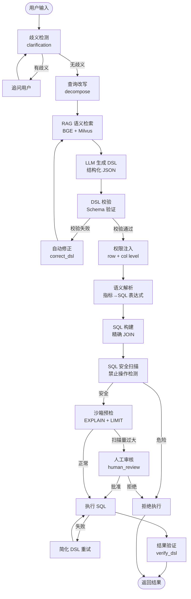

# NL2DSL Engine

> 让业务人员用自然语言查数，让数据团队掌控一切。

[](https://www.python.org/downloads/)
[](#)
[](https://opensource.org/licenses/MIT)

**NL2DSL 是企业级自然语言到 DSL 的智能问数引擎。** 它不替代你的数据治理体系，而是消费已有的治理定义（指标、维度、权限），给业务人员一个自然语言的查询入口。

---

## 为谁而建

你的数据团队已经做了这些工作：
- 指标口径统一（"销售额" = `SUM(pay_amount)`）
- 维度标准编码（"华东" = `HD`）
- 数据权限分级（谁能看到哪些行/列）
- 敏感数据脱敏（手机号显示为 `138****8888`）

但业务人员 still 写 SQL 或找数据团队提需求？NL2DSL 把治理成果转化为自然语言查询能力。

---

## 一分钟看懂效果

### 业务人员输入

```
查询华东地区销售额最高的 10 个产品
```

### NL2DSL 处理过程

```
自然语言
  → RAG 检索（找到 "华东"→region、"销售额"→sales_amount 等映射）
  → LLM 生成 DSL（结构化 JSON，可校验）
  → 系统校验（sales_amount 是否注册？region 维度是否存在？）
  → 权限注入（用户 u001 只能看华东数据）
  → 语义解析（sales_amount → SUM(pay_amount)，华东 → 'HD'）
  → SQL 构建（按需 JOIN，只 JOIN 被引用的表）
  → 安全扫描 + 沙箱预检
  → 执行 → 返回结果
```

### 生成的 DSL（中间产物，可审计）

```json
{
  "metrics": [{"func": "sum", "field": "pay_amount", "alias": "sales_amount"}],
  "dimensions": ["product_name", "region"],
  "filters": [
    {"field": "region", "operator": "=", "value": "华东"}
  ],
  "order_by": [{"field": "sales_amount", "direction": "desc"}],
  "limit": 10,
  "data_source": "orders"
}
```

### 执行的安全保障

| 检查点 | 作用 | 结果 |
|--------|------|------|
| DSL 校验 | 指标/维度是否已注册 | 未注册直接拦截 |
| 列级权限 | 是否访问敏感字段 | 越权拒绝 |
| 行级权限 | 自动注入租户/组织过滤 | 看不到别人的数据 |
| SQL 扫描 | 检测 DELETE/UNION/注释注入 | 危险操作拦截 |
| 沙箱预检 | EXPLAIN + LIMIT 预览 | 全表扫描告警 |

---

## 架构定位：数据治理的消费层


**图的阅读指南**：
- **实线箭头** = 数据流向（用户请求 → 引擎处理 → 数据库执行）
- **虚线箭头** = 依赖关系（引擎消费治理配置、共享组件被各域复用）
- **DomainContext** = 每个域的完整运行时（独立的 RAG、DSL 校验器、SQL 构建器、权限组件）
- 电商域和银行域的 `metrics.yaml` 彼此隔离，不会互相污染

**核心原则**：NL2DSL 不定义"什么是销售额"，只消费治理层已经定义好的 `sales_amount: SUM(pay_amount)`。就像 Tableau 消费数据仓库的度量定义一样。

### 与传统 NL2SQL 的区别

| | 传统 NL2SQL | NL2DSL |
|---|---|---|
| LLM 输出 | 自由文本 SQL | 结构化 JSON（DSL） |
| 可校验性 | 不可校验 | JSON Schema 校验 |
| 权限控制 | 事后拦截或无法干预 | DSL 层级注入过滤条件 |
| 安全可控 | SQL 注入风险高 | SQLAlchemy Core 参数化构建 |
| 数据治理依赖 | 无要求（直接查物理表） | **必须**有治理定义 |
| 多域支持 | 通常单域 | 自动发现多域配置 |

---

## 核心能力

### 1. 精确 JOIN 检测

不是所有查询都需要 JOIN 所有表。NL2DSL 分析 DSL 中引用的列，只 JOIN 实际需要的表。

**效果**：电商 `orders` 数据源配置了 5 个 JOIN，平均查询从 3.8 个 JOIN 降到 0.5 个，71% 的查询不需要任何 JOIN。

### 2. 多域自治

```
configs/
  metrics.yaml              # 默认域：电商
  bank_metrics.yaml         # 银行域
  bank_permissions.yaml     # 银行域权限
```

启动时自动发现所有 `_metrics.yaml`，每个域独立的数据库、向量库、RAG 检索器。

### 3. Agentic 自修正

查询链路中的智能节点：
- **decompose**：复杂问题改写（"对比今年和去年华东销售额" → 按年分组 + 限定两年范围）
- **correct_dsl**：校验失败后，LLM 决策检索关键词 → 定向 RAG 补充知识 → 重新生成
- **verify_dsl**：执行后自检，判断结果是否真正回答了用户问题

### 4. 配置即治理

业务人员改 YAML，重启生效：

```yaml
# configs/terms.yaml — 业务术语映射
terms:
  gmv:
    aliases: ["流水", "成交额", "交易额"]
    description: "成交总额"
```

LLM 看到用户说"查下流水"，就知道 alias 应该选 `gmv`。

---

## 前置条件（必读）

NL2DSL **不是数据治理工具**，它消费治理成果。部署前必须确保：

| 治理项 | 必须程度 | 说明 |
|--------|---------|------|
| 指标注册 | 必须 | 所有业务指标有标准计算式 |
| 维度注册 | 必须 | 所有维度有物理字段映射和值映射 |
| 数据源注册 | 必须 | 主表、JOIN 关系、可用指标/维度 |
| 权限策略 | 强烈建议 | 行过滤、列控制、脱敏规则 |
| 术语词典 | 建议 | 业务别名映射，提升 LLM 准确率 |

**成熟度评估**：
- 治理完善 → NL2DSL 体验极佳
- 治理部分 → 可用但 LLM 幻觉增加、权限有漏洞
- 治理缺失 → **不可用**，请先做治理

---

## 快速开始

### 环境

- Python 3.10+
- Node.js 18+（前端可选）

### 安装

```bash
pip install -r requirements.txt
```

### 配置

```bash
cp .env.example .env
# 填入 LLM API Key（支持智谱 / Ollama / 任意 OpenAI 兼容接口）
```

### 准备治理配置

```bash
mkdir -p configs
cat > configs/metrics.yaml << 'EOF'
metrics:
  sales_amount:
    expr: SUM(pay_amount)
    description: "销售额"

dimensions:
  region:
    column: region_code
    value_map:
      "华东": "HD"
      "华南": "HN"

data_sources:
  orders:
    table: order_fact
    metrics: [sales_amount]
    dimensions: [region]
EOF
```

### 启动

```bash
# 后端（首次启动自动同步 YAML 到向量库）
uvicorn nl2dsl.api:app --reload --host 0.0.0.0 --port 8000

# 前端（可选）
cd web && npm run dev
```

### 查询

```bash
curl -X POST http://localhost:8000/api/v1/query \
  -H "Content-Type: application/json" \
  -d '{
    "question": "查询华东地区的销售额",
    "user_id": "u001",
    "tenant_id": "t001"
  }'
```

---

## 项目结构

```
nl2dsl/
  engine.py          # 引擎入口：多域发现、组件组装
  api.py / api_factory.py   # FastAPI 路由
  config.py          # 环境配置
  plugin.py          # 插件框架
  dsl/               # DSL 模型与校验
  graph/             # LangGraph 查询管道
  llm/               # LLM 客户端
  rag/               # 向量检索（BGE + Milvus Lite）
  semantic/          # 语义注册中心
  sql_engine/        # SQL 构建 + 安全扫描 + 沙箱
  permission/        # 行级/列级权限
  audit/             # 审计日志
  feedback/          # 纠错反馈

configs/
  metrics.yaml       # 指标/维度/数据源
  terms.yaml         # 业务术语
  history.yaml       # 历史示例
  permissions.yaml   # 权限策略
```

---

## 查询管道（LangGraph 状态机）



**流程说明**：
- **菱形条件分支**：系统在每个检查点做出路由决策（歧义/无歧义、校验失败/通过、危险/安全、扫描量过大/正常）
- **循环修正**：DSL 校验失败 → 自动修正 → 重新 RAG → 重新生成，最多循环 3 次
- **安全闸门**：SQL 安全扫描（拦截 DELETE/UNION/注释注入）和沙箱预检（全表扫描告警）两道防线
- **人工审核**：仅当沙箱判定扫描量超过阈值时触发，审批后可放行或拒绝

---

## API 速览

| 方法 | 路径 | 说明 |
|------|------|------|
| POST | `/api/v1/query` | 自然语言查询（完整管道） |
| POST | `/api/v1/query/execute` | 直接执行 DSL |
| POST | `/api/v1/query/stream` | 流式查询（SSE） |
| GET | `/api/v1/schema?domain=` | 获取语义层 Schema |
| GET | `/api/v1/metrics?domain=` | 获取指标列表 |
| GET | `/api/v1/debug/rag?q=` | 调试 RAG 检索内容 |

完整 API 文档启动后访问：`http://localhost:8000/docs`

---

## 技术栈

| 用途 | 技术 |
|------|------|
| Web 框架 | FastAPI |
| 工作流引擎 | LangGraph (StateGraph) |
| LLM 接入 | OpenAI SDK 兼容（智谱 / Ollama / 通义千问） |
| SQL 构建 | SQLAlchemy Core |
| 向量存储 | Milvus Lite |
| 向量模型 | BGE-base-zh-v1.5 |
| 配置 | Pydantic Settings + YAML |
| 前端 | React + Vite + AntD + ECharts |

---

## License

MIT
