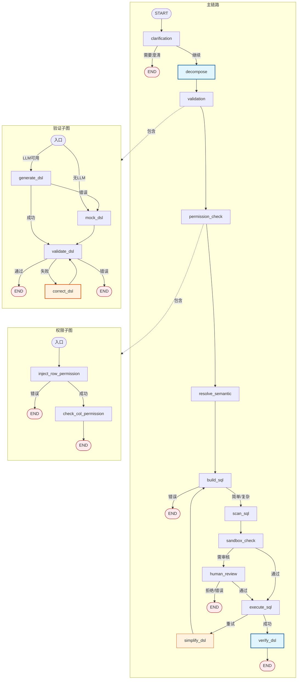

# NL2DSL Query Pipeline DAG

## 节点说明

| 节点 | 职责 | Agentic |
|------|------|---------|
| `clarification` | 检测歧义，需澄清时结束 | 否 |
| `decompose` | 复杂查询改写（对比/同比/趋势） | **是** |
| `validation` | DSL 生成+校验+修正子图 | 部分 |
| `permission_check` | 行级过滤+列级权限 | 否 |
| `resolve_semantic` | 语义解析 | 否 |
| `build_sql` | DSL→SQL | 否 |
| `scan_sql` | SQL 安全扫描 | 否 |
| `sandbox_check` | 沙箱检查 | 否 |
| `human_review` | 人工审核 | 否 |
| `execute_sql` | 正式执行 | 否 |
| `simplify_dsl` | 失败简化重试 | 否 |
| `verify_dsl` | LLM 自检结果 | **是** |

### Validation Subgraph

| 节点 | 职责 | Agentic |
|------|------|---------|
| `generate_dsl` | LLM 生成 DSL（带 RAG） | RAG |
| `mock_dsl` | 兜底生成 | 否 |
| `validate_dsl` | 结构校验 | 否 |
| `correct_dsl` | LLM 决策检索词→定向 RAG→重生成 | **是** |
