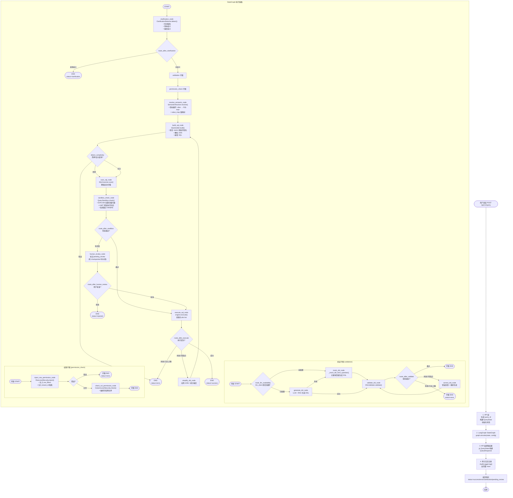
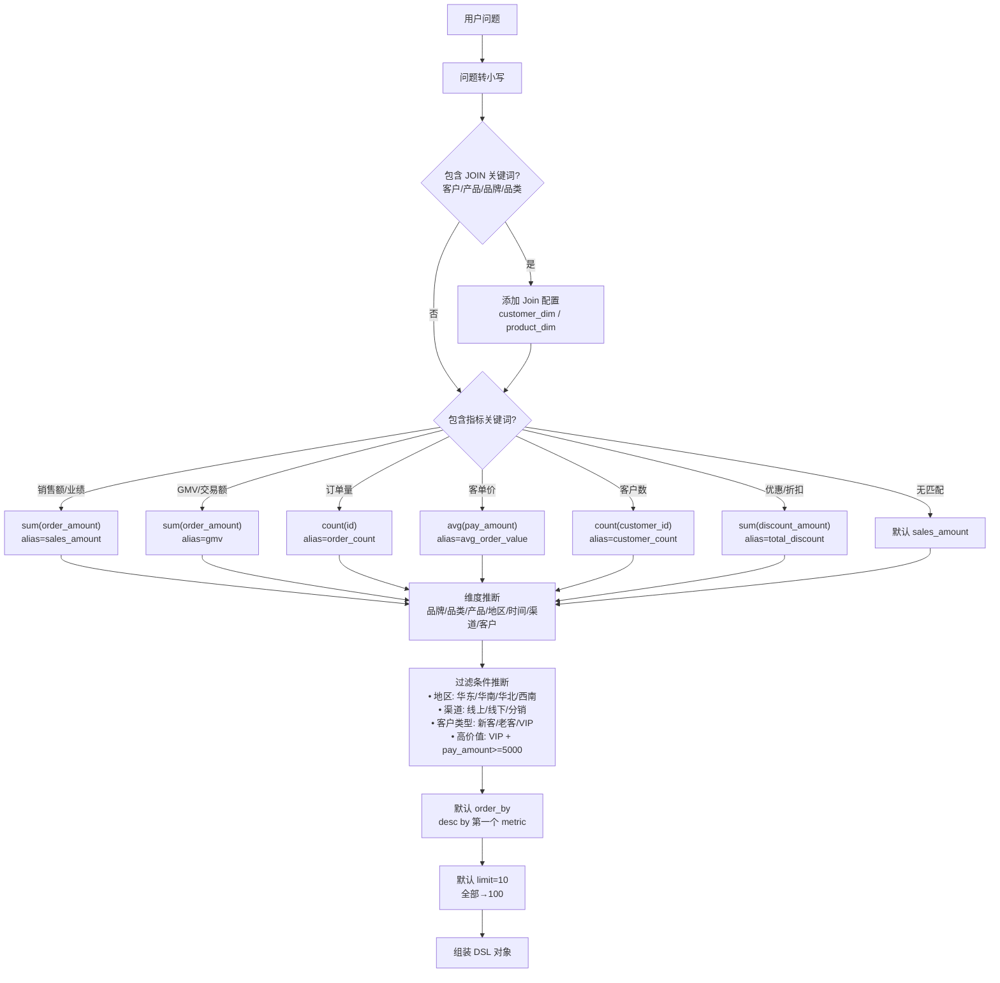
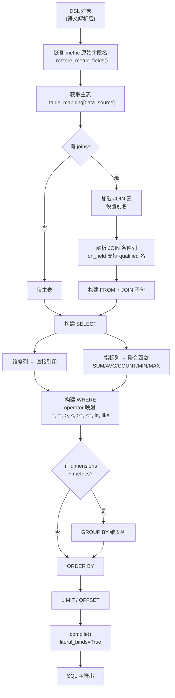
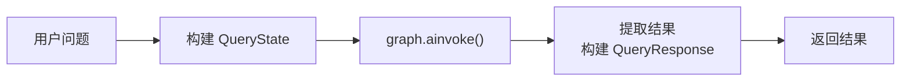
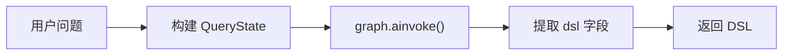
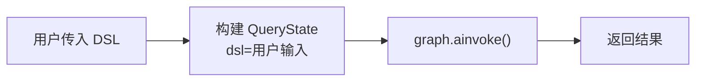
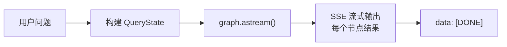
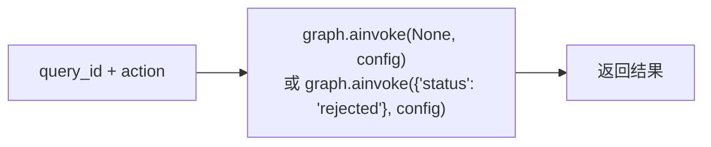
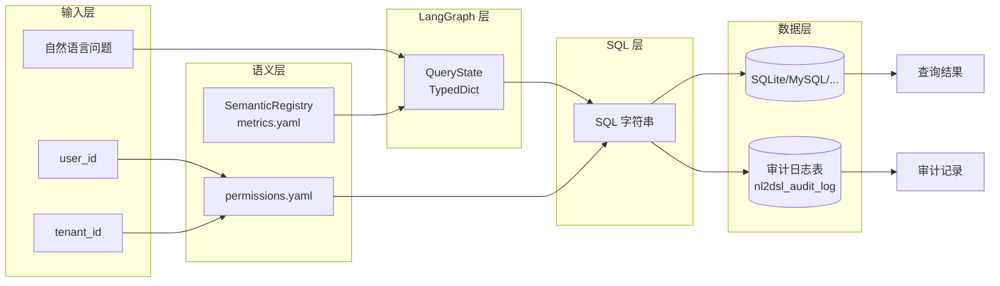

# NL2DSL 查询完整流程图

本文档描述用户自然语言查询从请求到结果返回的完整处理链路，基于 LangGraph StateGraph 架构。

---

## 一、顶层架构概览

```
用户请求 → API 层 → LangGraph StateGraph → 审计日志 → 返回响应
              ↓
         ┌──────────────────────────────────────────────┐
         │  clarification → validation 子图 →           │
         │  permission_check 子图 → resolve_semantic →  │
         │  build_sql → scan_sql → sandbox_check →      │
         │  [human_review] → execute_sql → END           │
         └──────────────────────────────────────────────┘
```

---

## 二、主查询链路详细流程图 (`POST /api/v1/query`)



---

## 三、各阶段状态码与异常映射表

| 阶段 | 状态/异常类型 | Error Code | HTTP Status | 触发场景 |
|------|-------------|-----------|-------------|---------|
| 歧义澄清 | `status=clarification` | — | 200 | 检测到时间缺失/指标歧义/维度歧义 |
| Sandbox 警告 | `status=warning` | — | 200 | 扫描行数超限 / 执行时间超限 / 缺少 WHERE 条件 |
| DSL 生成 | ValidationError | VALIDATION_ERROR | 400 | 验证子图重试耗尽 |
| DSL 校验 | ValidationError | VALIDATION_ERROR | 400 | 数据源/指标/维度不存在 |
| 行级权限 | — | — | — | 无权限配置则直通 |
| 列级权限 | PermissionError | PERMISSION_DENIED | 403 | 访问敏感字段 |
| 语义解析 | SemanticError | SEMANTIC_ERROR | 400 | 指标未定义 |
| SQL 构建 | ValidationError | VALIDATION_ERROR | 400 | 表不存在 / 列不存在 / 非法表达式 |
| SQL 扫描 | ValidationError | VALIDATION_ERROR | 400 | 检测到危险 SQL 模式 |
| SQL 执行 | Exception | INTERNAL_ERROR | 500 | 数据库执行失败 |
| 人工审核 | `status=pending_review` | — | 200 | 沙箱检测风险，等待人工确认 |
| 审计查询 | NotFoundError | NOT_FOUND | 404 | 审计记录不存在 |

---

## 四、StateGraph 节点详解

### 4.1 节点清单

| 节点 | 所在文件 | 说明 |
|------|---------|------|
| `clarification` | `builder.py` | 歧义检测，有歧义直接 END |
| `validation` (子图) | `subgraphs.py` | DSL 生成 + 校验 + 修正循环 |
| `permission_check` (子图) | `subgraphs.py` | 行级权限注入 + 列级权限检查 |
| `resolve_semantic` | `builder.py` | 指标展开为 SQL 表达式 |
| `build_sql` | `builder.py` | SQLAlchemy Core 构建 SQL |
| `scan_sql` | `builder.py` | SQL 安全扫描 |
| `sandbox_check` | `builder.py` | 预执行安全检测 |
| `human_review` | `builder.py` | 人工审核标记（可中断） |
| `execute_sql` | `builder.py` | 数据库执行 |
| `simplify_dsl` | `builder.py` | 简化 DSL 后重试 |

### 4.2 条件路由

| 路由函数 | 判断条件 | 分支 |
|---------|---------|------|
| `route_after_clarification` | `ambiguities` 是否存在 | `clarification` → END / `continue` → validation |
| `route_llm_availability` | `llm_client` 是否配置 | `llm` → generate_dsl / `mock` → mock_dsl |
| `route_after_validate` | 校验结果 + 重试次数 | `ok` → END / `retry` → correct_dsl / `error` → END |
| `detect_complexity` | joins / metrics / dimensions 数量 | `simple` / `complex` → scan_sql |
| `route_after_sandbox` | `sandbox_result.passed` | `review` → human_review / `execute` → execute_sql |
| `route_after_execute` | 执行结果 + 重试次数 | `retry` → simplify_dsl / `end` → END |
| `route_on_error` | `error_code` 是否致命 | `end` → END / `continue` → 尝试恢复 |

---

## 五、各节点内部详细流程

### 5.1 clarification_node — 歧义检测节点

**输入**: `state["question"]` — 用户的自然语言问题

**内部处理流程**:

```
┌─────────────────────────────────────────────────────────────────────┐
│                    ClarificationDetector.detect(question)           │
│                                                                     │
│  Step 1: 时间缺失检测                                               │
│    ├─ 检查问题是否包含 _TIME_KEYWORDS 中的关键词                     │
│    │   (本月, 上月, 今天, 昨天, 最近, 年, 月, 日, 周,               │
│    │    上半年, 下半年, 季度, Q1-Q4, 1月-12月, 2023-2025)          │
│    ├─ 正则匹配日期模式: \d{4}[-/年]\d{1,2}                          │
│    └─ 若均未命中 → 添加 ClarificationItem(type="time_missing")      │
│                                                                     │
│  Step 2: 指标歧义检测                                               │
│    ├─ 遍历 _METRIC_AMBIGUOUS 字典                                  │
│    │   "销量"   → ["支付订单量", "发货数量", "完成数量"]            │
│    │   "销售额" → ["实付金额", "订单金额", "GMV"]                   │
│    │   "客户数" → ["注册用户", "下单用户", "支付用户"]              │
│    └─ 若关键词命中 → 添加 ClarificationItem(type="metric_ambiguous")│
│                                                                     │
│  Step 3: 维度歧义检测                                               │
│    ├─ 遍历 _DIMENSION_AMBIGUOUS 字典                               │
│    │   "地区" → ["收货地址", "发货仓库", "注册地"]                  │
│    │   "时间" → ["下单时间", "发货时间", "支付时间"]                │
│    └─ 若关键词命中 → 添加 ClarificationItem(type="dimension_ambiguous")│
│                                                                     │
│  Step 4: 比较基准歧义                                               │
│    ├─ 检测问题是否包含 "增长", "下降", "同比", "环比"               │
│    ├─ 但未包含 "同比", "环比", "上月", "去年"                      │
│    └─ 若满足 → 添加 ClarificationItem(type="comparison_ambiguous")  │
│                                                                     │
└─────────────────────────────────────────────────────────────────────┘
```

**输出**:
- 若 `ambiguities` 非空 → `{"ambiguities": [...], "status": "clarification", "trace": {...}}`
- 若无歧义 → `{"ambiguities": None, "trace": {...}}`

**路由**: `route_after_clarification` — 有歧义则 END，无歧义进入 validation 子图。

---

### 5.2 generate_dsl_node — LLM 生成 DSL 节点

**输入**: `state["question"]`, `state.get("data_source")`

**内部处理流程**:

```
┌─────────────────────────────────────────────────────────────────────┐
│                         generate_dsl_node                           │
│                                                                     │
│  Step 1: 检查 LLM 可用性                                            │
│    ├─ 若 llm_client is None → 抛出 ValidationError("LLM unavailable")│
│    └─ 否则继续                                                      │
│                                                                     │
│  Step 2: 构建 Prompt                                                │
│    ├─ 若 rag_retriever 存在:                                        │
│    │   └─ rag_retriever.build_prompt(question)                     │
│    │       ├─ retrieve_hybrid(query): 语义检索 + 关键词检索         │
│    │       │   ├─ jieba 分词 → 过滤停用词 → 匹配向量库关键词        │
│    │       │   ├─ 4 个 collection: schema, metrics, history, terms │
│    │       │   └─ merge 去重                                        │
│    │       └─ 组装为 【表结构】【指标定义】【历史查询】【业务术语】   │
│    └─ 若 rag_retriever 不存在:                                      │
│        └─ 使用硬编码 fallback prompt (_build_fallback_prompt)       │
│           包含 orders/products/customers 三表结构                   │
│                                                                     │
│  Step 3: 调用 LLM                                                   │
│    └─ llm_client.generate(prompt, system_prompt)                   │
│        → 返回原始字符串 raw                                          │
│                                                                     │
│  Step 4: 解析 LLM 输出                                              │
│    ├─ 若 raw 为空 → 抛出 ValidationError("LLM empty response")     │
│    └─ _parse_llm_output(raw):                                       │
│        ├─ 去除首尾 ``` 代码块标记                                   │
│        ├─ 去除 "json\n" 前缀                                        │
│        └─ json.loads() → dsl_dict                                   │
│                                                                     │
│  Step 5: 后处理与规范化 (_post_process_dsl)                         │
│    ├─ 确保 data_source 有效 (orders/products/customers)            │
│    ├─ 确保 metrics 非空 (默认 sum(order_amount) alias=sales_amount)│
│    ├─ 剥离 field 上的聚合函数包装: SUM(col) → col                   │
│    ├─ 确保 dimensions 非空 (默认 product_name)                     │
│    ├─ 确保 limit 合理 (默认 10, 上限 100)                          │
│    ├─ 确保 offset 存在 (默认 0)                                     │
│    ├─ 自动补全 order_by (默认按第一个 metric desc)                  │
│    └─ 校验 operator 白名单 (=, !=, >, <, >=, <=, in, like)         │
│                                                                     │
│  Step 6: Pydantic 校验                                              │
│    └─ DSL.model_validate(dsl_dict) → DSL 对象                      │
│                                                                     │
└─────────────────────────────────────────────────────────────────────┘
```

**输出**:
```python
{
    "dsl": DSL,                    # 生成的 DSL 对象
    "llm_used": True,              # 标记使用了 LLM
    "dsl_attempts": {              # 记录本次尝试
        "source": "llm",
        "dsl": {...},
        "timestamp": <float>,
    },
    "trace": {"step": "generate_dsl", "status": "success", "source": "llm"},
}
```

**错误处理**: `@with_error_handler("generate_dsl")` 捕获所有异常 → `status=error`, `error_code=VALIDATION_ERROR/INTERNAL_ERROR`

---

### 5.3 mock_dsl_node — Mock DSL 生成节点

**输入**: `state["question"]`, `state.get("data_source")`

**内部处理流程**:

```
┌─────────────────────────────────────────────────────────────────────┐
│                      _mock_dsl_from_question()                      │
│                                                                     │
│  Step 1: 检测 JOIN 意图                                             │
│    ├─ customer_dim 触发词: ["客户", "customer", "用户", "user",    │
│    │                        "买家", "高价值", "VIP", "会员"]        │
│    ├─ product_dim 触发词: ["品牌", "brand", "品类", "category",    │
│    │                        "产品详情", "单价", "price"]            │
│    └─ 命中则添加 Join(table=..., on_field=..., join_type=...)      │
│                                                                     │
│  Step 2: 指标推断 (按优先级匹配)                                    │
│    ├─ "销售额"/"sales"/"业绩" → sum(order_amount) alias=sales_amount│
│    ├─ "gmv"/"成交总额"          → sum(order_amount) alias=gmv       │
│    ├─ "订单量"/"订单数"         → count(id) alias=order_count       │
│    ├─ "客单价"/"平均订单"       → avg(pay_amount) alias=avg_order_value│
│    ├─ "客户数"/"用户数"         → count(customer_id) alias=customer_count│
│    ├─ "优惠"/"折扣"             → sum(discount_amount) alias=total_discount│
│    └─ 无匹配 → 默认 sales_amount                                    │
│                                                                     │
│  Step 3: 维度推断 (关键词匹配)                                      │
│    ├─ "品牌"/"brand"     → "brand"                                 │
│    ├─ "品类"/"category"  → "category"                              │
│    ├─ "产品"/"product"   → "product_name"                          │
│    ├─ "地区"/"区域"      → "region"                                │
│    ├─ "时间"/"日期"      → "order_date"                            │
│    ├─ "渠道"             → "channel"                               │
│    ├─ "客户"/"customer"  → "customer_type"/"customer_name"         │
│    └─ 无匹配 → 默认 "product_name"                                  │
│                                                                     │
│  Step 4: 过滤条件推断                                               │
│    ├─ 地区: 华东/华南/华北/西南 → operator="=", value="..."        │
│    ├─ 渠道: 线上/线下/分销        → operator="=", value="..."        │
│    ├─ 语义过滤 "高价值" → customer_type=VIP + pay_amount>=5000    │
│    ├─ "新客"/"老客"/"VIP" → operator="=", value="..."              │
│    └─ 无匹配 → filters=None                                        │
│                                                                     │
│  Step 5: 默认值填充                                                 │
│    ├─ order_by: 第一个 metric alias desc                           │
│    ├─ limit: "全部"/"所有" → 100, 否则 10                          │
│    └─ data_source: 传入值或默认 "orders"                            │
│                                                                     │
└─────────────────────────────────────────────────────────────────────┘
```

**输出**:
```python
{
    "dsl": DSL,                    # Mock 生成的 DSL
    "llm_used": False,             # 标记未使用 LLM
    "status": "pending",           # 清除之前的 error 状态
    "error": None,
    "error_code": None,
    "dsl_attempts": {
        "source": "mock",
        "dsl": {...},
        "timestamp": <float>,
    },
    "trace": {"step": "mock_dsl", "status": "success", "source": "mock"},
}
```

---

### 5.4 validate_dsl_node — DSL 校验节点

**输入**: `state.get("dsl")`

**内部处理流程**:

```
┌─────────────────────────────────────────────────────────────────────┐
│                    DSLValidator.validate(dsl)                       │
│                                                                     │
│  校验项 (registry 来自 configs/metrics.yaml):                       │
│                                                                     │
│  1. data_source 存在性                                              │
│     ├─ 检查 dsl.data_source ∈ registry["data_sources"].keys()      │
│     └─ 不在 → errors.append("数据源 'xxx' 不存在")                  │
│                                                                     │
│  2. metrics 存在性                                                  │
│     ├─ 遍历 dsl.metrics                                             │
│     ├─ 若 m.alias 存在且不在 registry["metrics"] 中                 │
│     └─ → errors.append("指标 'xxx' 不存在")                        │
│                                                                     │
│  3. dimensions 存在性                                               │
│     ├─ 遍历 dsl.dimensions                                          │
│     ├─ 若 dim 不在 registry["dimensions"] 中                        │
│     └─ → errors.append("维度 'xxx' 不存在")                        │
│                                                                     │
│  4. 非空校验                                                        │
│     └─ metrics 和 dimensions 均为空 → errors.append("必须指定...")  │
│                                                                     │
│  5. 结果处理                                                        │
│     ├─ errors 非空 → raise ValidationError("; ".join(errors))     │
│     └─ errors 为空 → 通过 (无返回值)                                │
│                                                                     │
└─────────────────────────────────────────────────────────────────────┘
```

**输出**: 校验通过 → `{"trace": {"step": "validate_dsl", "status": "success"}}`

**错误**: 校验失败 → `@with_error_handler` 捕获 `ValidationError` → `status=error`, `error=...`, `error_code=VALIDATION_ERROR`

**路由**: `route_after_validate`:
- `status == error` → 检查 `dsl_attempts` 数量
  - `>= 3` → `"error"` → END
  - `< 3` → `"retry"` → correct_dsl_node
- 无错误 → `"ok"` → END

---

### 5.5 correct_dsl_node — DSL 修正节点

**输入**: `state["question"]`, `state.get("data_source")`, `state.get("error")`

**内部处理流程**:

```
┌─────────────────────────────────────────────────────────────────────┐
│                        correct_dsl_node                             │
│                                                                     │
│  Step 1: 优先尝试 LLM 修正                                          │
│    ├─ 若 llm_client 存在:                                           │
│    │   └─ 构建 feedback prompt:                                     │
│    │       "Previous generation failed with error: {error}          │
│    │        Please fix the errors and generate a correct DSL JSON.  │
│    │        【用户问题】{question}                                    │
│    │        请输出 DSL JSON："                                      │
│    │   └─ llm_client.generate(feedback, system_prompt)             │
│    │   └─ 解析 → _post_process_dsl → DSL.model_validate            │
│    │   └─ 成功 → source="llm_corrected"                             │
│    └─ 若 LLM 不可用或失败:                                          │
│        └─ fallback 到 _mock_dsl_from_question()                    │
│        └─ source="mock_corrected"                                   │
│                                                                     │
│  Step 2: 记录尝试信息                                               │
│    └─ dsl_attempts 追加:                                           │
│        {source, dsl, timestamp, error_feedback: error}             │
│                                                                     │
└─────────────────────────────────────────────────────────────────────┘
```

**输出**: 更新后的 `dsl`, `dsl_attempts`, `trace`

**下游**: 修正后返回 validate_dsl_node 重新校验（循环）。

---

### 5.6 inject_row_permission_node — 行级权限注入节点

**输入**: `state.get("dsl")`, `state["user_id"]`

**内部处理流程**:

```
┌─────────────────────────────────────────────────────────────────────┐
│                  RowLevelSecurity.inject(dsl, user_id)              │
│                                                                     │
│  Step 1: 查找用户权限配置                                           │
│    └─ user_perm = permissions.get(user_id)                         │
│       若不存在 → 原样返回 dsl (无权限 = 全通)                       │
│                                                                     │
│  Step 2: 注入行级过滤条件                                           │
│    ├─ 遍历 user_perm["row_filters"]                                │
│    │   └─ 每个 field → Filter(field, operator, value)              │
│    │       例: region: {operator: "in", value: ["华东","华南"]}     │
│    │       → Filter(field="region", operator="in",                 │
│    │                 value=["华东", "华南"])                          │
│                                                                     │
│  Step 3: 注入租户隔离条件                                           │
│    ├─ 若 user_perm["tenant_id"] 存在                               │
│    └─ → Filter(field="tenant_id", operator="=", value=tenant_id)  │
│                                                                     │
│  Step 4: 组装新 DSL                                                 │
│    └─ dsl.model_copy(update={"filters": new_filters})              │
│       (原 filters + 注入的 filters 合并)                            │
│                                                                     │
└─────────────────────────────────────────────────────────────────────┘
```

**输出**: `{"dsl": <注入权限后的 DSL>, "trace": {"step": "inject_row_permission", "status": "success"}}`

**错误**: dsl is None → ValidationError

---

### 5.7 check_col_permission_node — 列级权限检查节点

**输入**: `state.get("dsl")`, `state["user_id"]`

**内部处理流程**:

```
┌─────────────────────────────────────────────────────────────────────┐
│              ColumnLevelSecurity.check(dsl, user_id)                │
│                                                                     │
│  Step 1: 遍历 dsl.dimensions                                        │
│                                                                     │
│  Step 2: 检查每个维度是否在敏感字段列表中                             │
│    ├─ sensitive_columns 来自 configs/permissions.yaml               │
│    │   ├─ salary (high)                                            │
│    │   ├─ phone (high)                                             │
│    │   ├─ id_card (high)                                           │
│    │   └─ email (medium)                                           │
│    └─ 若命中 → raise PermissionError("无权访问敏感字段: {dim}")      │
│                                                                     │
│  注意: 不返回更新后的 DSL，仅做权限校验。                            │
│        若通过，trace 记录成功；若失败，error_handler 转为 error 状态 │
│                                                                     │
└─────────────────────────────────────────────────────────────────────┘
```

**输出**: 通过 → `{"trace": {"step": "check_col_permission", "status": "success"}}`

**错误**: 命中敏感字段 → PermissionError → `status=error`, `error_code=PERMISSION_DENIED`, HTTP 403

---

### 5.8 resolve_semantic_node — 语义解析节点

**输入**: `state.get("dsl")`

**内部处理流程**:

```
┌─────────────────────────────────────────────────────────────────────┐
│                  SemanticResolver.resolve(dsl)                      │
│                                                                     │
│  Step 1: 指标展开 (_resolve_metrics)                                │
│    ├─ 遍历 dsl.metrics                                              │
│    ├─ 根据 metric.alias 从 registry["metrics"] 查找 expr            │
│    │   例: alias="sales_amount" → expr="SUM(order_amount)"        │
│    ├─ 若 alias 存在但 expr 未定义 → raise SemanticError              │
│    └─ 将 metric.field 替换为 expr: m.model_copy(update={"field": expr})│
│                                                                     │
│       转换示例:                                                     │
│       输入:  Aggregation(func="sum", field="order_amount",          │
│                         alias="sales_amount")                       │
│       输出:  Aggregation(func="sum", field="SUM(order_amount)",     │
│                         alias="sales_amount")                       │
│                                                                     │
│  Step 2: 过滤条件值映射 (_resolve_filters)                          │
│    ├─ 遍历 dsl.filters                                              │
│    ├─ 根据 filter.field 从 registry["dimensions"] 查找              │
│    ├─ 若存在 value_map → 将 value 做映射转换                        │
│    │   例: value_map={"新客": "new", "老客": "old"}                │
│    │   filter.value="新客" → "new"                                  │
│    └─ 同时更新 field 为 column 名: dim.get("column", f.field)       │
│                                                                     │
│  Step 3: 返回更新后的 DSL                                           │
│    └─ dsl.model_copy(update={"metrics": new_metrics,                │
│                               "filters": new_filters})              │
│                                                                     │
└─────────────────────────────────────────────────────────────────────┘
```

**输出**: `{"dsl": <语义解析后的 DSL>, "trace": {"step": "resolve_semantic", "status": "success"}}`

---

### 5.9 build_sql_node — SQL 构建节点

**输入**: `state.get("dsl")`

**内部处理流程**:

```
┌─────────────────────────────────────────────────────────────────────┐
│                        build_sql_node                               │
│                                                                     │
│  Step 0: 恢复 metric 原始字段名                                     │
│    └─ _restore_metric_fields(dsl)                                   │
│       将 "SUM(order_amount)" 恢复为 "order_amount"                 │
│       (因为 SQLBuilder 需要自己解析函数名和列名)                     │
│                                                                     │
│  Step 1: 确定主表                                                   │
│    ├─ primary_table_name = _table_mapping[data_source]              │
│    │   例: "orders" → "order_fact"                                 │
│    └─ 从 SQLAlchemy MetaData 反射获取 Table 对象                    │
│       若不存在 → raise ValidationError("Primary table not found")   │
│                                                                     │
│  Step 2: 收集 JOIN 表                                               │
│    ├─ 遍历 dsl.joins                                                │
│    ├─ 从 metadata 获取 join_table                                   │
│    ├─ 设置别名: join_table.alias(alias)                            │
│    └─ 解析 JOIN 条件列:                                             │
│       ├─ on_field 可能是 qualified 名 (如 "customer_dim.customer_id")│
│       ├─ 主表侧: primary_table.c[on_field] 或 _resolve_column      │
│       └─ JOIN 表侧: join_table_ref.c[on_field]                     │
│                                                                     │
│  Step 3: 构建 SELECT 列                                             │
│    ├─ dimensions → 直接引用列 ( _resolve_column )                  │
│    └─ metrics → 聚合函数:                                           │
│       ├─ 若 field 包含 "(" → _parse_expr 提取 (func_name, col_name)│
│       │   例: "SUM(order_amount)" → ("sum", "order_amount")        │
│       ├─ 白名单校验: func_name ∈ {sum, avg, count, min, max}       │
│       └─ getattr(func, func_name)(col).label(alias)                │
│                                                                     │
│  Step 4: 构建 FROM + JOIN                                           │
│    ├─ 无 JOIN: select(...).select_from(primary_table)              │
│    └─ 有 JOIN: 循环 join_clauses 构建 joined table                  │
│       from_clause = primary_table.join(join_table_ref, condition)  │
│                                                                     │
│  Step 5: 构建 WHERE                                                 │
│    ├─ operator 映射:                                                │
│    │   "="  → col == value                                          │
│    │   "!=" → col != value                                          │
│    │   ">"  → col > value                                           │
│    │   "<"  → col < value                                           │
│    │   ">=" → col >= value                                          │
│    │   "<=" → col <= value                                          │
│    │   "in" → col.in_(value)                                        │
│    │   "like" → col.like(f"%{value}%")                              │
│    └─ 多条件 → and_(*conditions)                                    │
│                                                                     │
│  Step 6: GROUP BY (有 dimensions + metrics 时)                     │
│    └─ group_by(*dimension_columns)                                  │
│                                                                     │
│  Step 7: ORDER BY                                                   │
│    ├─ 尝试 _resolve_column 解析列                                   │
│    ├─ 失败且 field 是 metric alias → 使用 text() 包装               │
│    │   stmt.order_by(desc(text(alias)))                             │
│    └─ direction: "desc"/"asc"                                       │
│                                                                     │
│  Step 8: LIMIT / OFFSET                                             │
│                                                                     │
│  Step 9: 编译为 SQL 字符串                                          │
│    └─ stmt.compile(engine, compile_kwargs={"literal_binds": True}) │
│       (将参数内联到 SQL 中，便于审计和扫描)                         │
│                                                                     │
└─────────────────────────────────────────────────────────────────────┘
```

**输出**: `{"sql": <SQL 字符串>, "trace": {"step": "build_sql", "status": "success"}}`

---

### 5.10 scan_sql_node — SQL 安全扫描节点

**输入**: `state.get("sql")`

**内部处理流程**:

```
┌─────────────────────────────────────────────────────────────────────┐
│                      SQLScanner.scan(sql)                           │
│                                                                     │
│  白名单模式扫描 — 禁止一切非 SELECT 操作:                            │
│                                                                     │
│  1. 危险操作检测 (不区分大小写)                                     │
│     ├─ DELETE | UPDATE | DROP | INSERT | ALTER | CREATE | TRUNCATE │
│     └─ 命中 → ValidationError("SQL 安全检查失败: 检测到危险操作")   │
│                                                                     │
│  2. 块注释检测                                                      │
│     ├─ /\*.*?\*/                                                   │
│     └─ 命中 → ValidationError("SQL 安全检查失败: 检测到块注释")     │
│                                                                     │
│  3. 行注释检测                                                      │
│     ├─ --[^\n]*                                                    │
│     └─ 命中 → ValidationError("SQL 安全检查失败: 检测到行注释")     │
│                                                                     │
│  4. UNION 检测                                                      │
│     ├─ \bUNION\b                                                   │
│     └─ 命中 → ValidationError("SQL 安全检查失败: 检测到 UNION")     │
│                                                                     │
│  5. 多语句检测                                                      │
│     ├─ ;\s*\w+                                                     │
│     └─ 命中 → ValidationError("SQL 安全检查失败: 检测到多语句")     │
│                                                                     │
│  全部通过 → 无返回值 (成功)                                         │
│                                                                     │
└─────────────────────────────────────────────────────────────────────┘
```

**输出**: 通过 → `{"trace": {"step": "scan_sql", "status": "success"}}`

**错误**: 命中任何禁止模式 → ValidationError → `status=error`, `error_code=VALIDATION_ERROR`

---

### 5.11 sandbox_check_node — 沙箱检查节点

**输入**: `state.get("sql")`

**内部处理流程**:

```
┌─────────────────────────────────────────────────────────────────────┐
│                     QuerySandbox.check(sql)                         │
│                                                                     │
│  配置参数 (默认):                                                   │
│    ├─ max_scan_rows = 100,000                                       │
│    ├─ max_exec_time_ms = 5,000                                      │
│    └─ preview_limit = 10                                            │
│                                                                     │
│  Step 1: EXPLAIN QUERY PLAN (SQLite 专用)                          │
│    ├─ 执行: EXPLAIN QUERY PLAN {sql}                               │
│    ├─ 统计 SCAN/SEARCH 操作次数                                     │
│    ├─ 预估扫描行数 = scan_count * 1000 (启发式估算)                 │
│    └─ 若 > max_scan_rows → risks.append("预估扫描 X 行，超过阈值") │
│                                                                     │
│  Step 2: LIMIT 预览执行                                             │
│    ├─ _inject_limit(sql, 10):                                       │
│    │   ├─ 若 SQL 已含 LIMIT → 不修改                                │
│    │   └─ 否则 → "{sql} LIMIT 10"                                   │
│    ├─ 执行预览查询                                                  │
│    ├─ 记录执行时间 elapsed_ms                                       │
│    ├─ 收集 sample_rows (前 10 行)                                   │
│    ├─ 若执行异常 → risks.append("预览执行失败: {e}")               │
│    └─ 若 elapsed_ms > max_exec_time_ms                              │
│       → risks.append("预览执行时间 Xms，超过阈值")                  │
│                                                                     │
│  Step 3: 启发式全表扫描检测                                         │
│    └─ 若 "WHERE" 不在 SQL 中                                        │
│       → risks.append("SQL 缺少 WHERE 条件，可能触发全表扫描")       │
│                                                                     │
│  Step 4: 组装结果                                                   │
│    ├─ passed = len(risks) == 0                                      │
│    ├─ risks: list[str]                                              │
│    ├─ sample_rows: list[dict]                                       │
│    ├─ estimated_rows: int                                           │
│    └─ execution_time_ms: float                                      │
│                                                                     │
└─────────────────────────────────────────────────────────────────────┘
```

**输出**:
```python
{
    "sandbox_result": SandboxResult(
        passed=<bool>,
        risks=[...],
        sample_rows=[...],
        estimated_rows=<int>,
        execution_time_ms=<float>,
    ),
    "trace": {
        "step": "sandbox_check",
        "status": "success" if passed else "warning",
        "passed": passed,
        "risks": risks,
    },
}
```

**路由**: `route_after_sandbox`
- `passed=True` → `"execute"` → execute_sql_node
- `passed=False` → `"review"` → human_review_node

---

### 5.12 human_review_node — 人工审核节点

**输入**: `state.get("sandbox_result")`

**内部处理流程**:

```
┌─────────────────────────────────────────────────────────────────────┐
│                      human_review_node                              │
│                                                                     │
│  这是一个占位节点，设置 pending_review 状态。                        │
│                                                                     │
│  在有 checkpointer 时:                                              │
│    ├─ builder.compile(checkpointer=..., interrupt_before=["human_review"])│
│    └─ 流程在此处中断，等待外部干预                                   │
│                                                                     │
│  恢复方式:                                                          │
│    ├─ 批准: graph.ainvoke(None, config)                            │
│    │   → 继续执行 execute_sql_node                                 │
│    └─ 拒绝: graph.ainvoke({"status": "rejected"}, config)           │
│       → route_after_human_review → "end" → END                     │
│                                                                     │
└─────────────────────────────────────────────────────────────────────┘
```

**输出**:
```python
{
    "status": "pending_review",
    "trace": {
        "step": "human_review",
        "status": "pending_review",
        "reason": "sandbox_warnings",
        "risks": sandbox_result.risks,
    },
}
```

---

### 5.13 execute_sql_node — SQL 执行节点

**输入**: `state.get("sql")`

**内部处理流程**:

```
┌─────────────────────────────────────────────────────────────────────┐
│                      SQLExecutor.execute(sql)                       │
│                                                                     │
│  Step 1: 通过 SQLAlchemy Engine 建立连接                            │
│    └─ with engine.connect() as conn:                                │
│                                                                     │
│  Step 2: 执行 SQL                                                   │
│    └─ conn.execute(text(sql))                                      │
│                                                                     │
│  Step 3: 结果转换为 dict list                                       │
│    ├─ 遍历 result 中的每一行                                        │
│    ├─ row._mapping → dict                                           │
│    └─ 收集为 list[dict]                                             │
│                                                                     │
│  Step 4: 返回数据                                                   │
│    └─ list[dict]  (每行一个 dict，列名为 key)                       │
│                                                                     │
└─────────────────────────────────────────────────────────────────────┘
```

**输出**:
```python
{
    "data": [{"col1": val1, "col2": val2}, ...],
    "status": "success",
    "trace": {"step": "execute_sql", "status": "success", "rows_returned": <count>},
}
```

**错误**: 执行异常 → `@with_error_handler` → `status=error`, `error_code=INTERNAL_ERROR`, HTTP 500

**路由**: `route_after_execute`
- `status == error` 且 `dsl_attempts` 数量 <= 1 → `"retry"` → simplify_dsl_node
- `status == error` 且重试次数已耗尽 → `"end"` → END
- `status == success` → `"end"` → END

---

### 5.14 simplify_dsl_node — DSL 简化节点

**输入**: `state.get("dsl")`

**内部处理流程**:

```
┌─────────────────────────────────────────────────────────────────────┐
│                      simplify_dsl_node                              │
│                                                                     │
│  简化策略 (去除复杂要素，提高成功率):                                │
│                                                                     │
│  1. metrics: 仅保留第一个                                           │
│     ├─ dsl.metrics[:1]                                              │
│     └─ 若无 metrics → None                                          │
│                                                                     │
│  2. dimensions: 仅保留第一个                                        │
│     ├─ dsl.dimensions[:1]                                           │
│     └─ 若无 dimensions → None                                       │
│                                                                     │
│  3. joins: 设为 None (移除所有 JOIN)                                │
│                                                                     │
│  4. filters: 设为 None (移除所有过滤条件)                           │
│                                                                     │
│  5. order_by: 设为 None                                             │
│                                                                     │
│  6. limit: min(dsl.limit or 10, 10)                                │
│     └─ 确保不超过 10 条                                             │
│                                                                     │
│  Step: dsl.model_copy(update={...})                                │
│                                                                     │
└─────────────────────────────────────────────────────────────────────┘
```

**输出**:
```python
{
    "dsl": <简化后的 DSL>,
    "dsl_attempts": {
        "source": "simplified",
        "dsl": {...},
        "timestamp": <float>,
        "original_dsl": <原始 DSL>,
    },
    "trace": {"step": "simplify_dsl", "status": "success"},
}
```

**下游**: 返回 build_sql_node 重新构建 SQL（循环）。

---

## 六、验证子图内部流程


**子图入口路由** (`_route_entry`):
- `llm_client is not None` → `"llm"` → generate_dsl
- 否则 → `"mock"` → mock_dsl

**generate_dsl → validate_dsl 路由** (`_route_after_generate_dsl`):
- `status == error` → `"fallback"` → mock_dsl (清除错误状态)
- 否则 → `"continue"` → validate_dsl

**validate_dsl → 出口路由** (`route_after_validate`):
- `status == error` → 检查重试次数
  - `>= 3` → `"error"` → END
  - `< 3` → `"retry"` → correct_dsl
- 无错误 → `"ok"` → END

**循环**: correct_dsl → validate_dsl (最多 3 次尝试)

---

## 七、权限子图内部流程


**错误路由** (`_route_on_error`):
- `status == error` → `"end"` → 子图 END
- 否则 → `"continue"` → check_col

---

## 八、Mock DSL 生成逻辑



---

## 九、SQL 构建阶段内部流程



---

## 十、辅助接口流程

### 10.1 `POST /api/v1/query` — 自然语言查询



### 10.2 `POST /api/v1/query/dsl` — 仅生成 DSL



### 10.3 `POST /api/v1/query/execute` — 直接执行 DSL



### 10.4 `POST /api/v1/query/stream` — 流式查询



### 10.5 `POST /api/v1/query/resume` — 恢复中断流程



---

## 十一、审计 Trace 结构

每条查询的 `trace` 数组由各节点通过 `Annotated[list[dict], add_to_list]` reducer 自动累积：

```json
[
  {
    "step": "clarification",
    "status": "success",
    "items_count": 0
  },
  {
    "step": "mock_dsl",
    "status": "success",
    "source": "mock"
  },
  {
    "step": "validate_dsl",
    "status": "success"
  },
  {
    "step": "inject_row_permission",
    "status": "success"
  },
  {
    "step": "check_col_permission",
    "status": "success"
  },
  {
    "step": "resolve_semantic",
    "status": "success"
  },
  {
    "step": "build_sql",
    "status": "success"
  },
  {
    "step": "scan_sql",
    "status": "success"
  },
  {
    "step": "sandbox_check",
    "status": "success",
    "risks": []
  },
  {
    "step": "execute_sql",
    "status": "success",
    "rows_returned": 10
  }
]
```

---

## 十二、数据流图



---

## 十三、关键设计决策

1. **LangGraph StateGraph**: 用 StateGraph 建模查询管道，获得条件分支、检查点、流式输出、子图封装、LangSmith 追踪等原生能力。

2. **LLM 只生成 DSL 不生成 SQL**：DSL 是结构化 JSON，可校验、可修正、可做权限控制；SQL 是自由文本，出错后难以定位。

3. **LLM 路径与 Mock 路径独立**：LLM 未配置时使用 Mock（开发环境），LLM 配置正常时只走 LLM。LLM 调用失败时不给出低质量 Mock 结果，而是明确报错。

4. **验证子图内循环修正**：DSL 验证失败时，correct_dsl_node 将错误信息反馈给 LLM 重新生成，最多重试 3 次。

5. **歧义检测前置（Clarification）**：在 DSL 生成前检测用户问题的歧义（时间缺失、指标/维度歧义），返回澄清问题而非猜测，降低错误生成概率。

6. **Sandbox 预执行检查**：在正式执行 SQL 前运行 EXPLAIN + LIMIT 预览，检测全表扫描、执行超时、缺少 WHERE 等风险，拦截危险查询。

7. **语义层隔离业务与物理模型**：指标/维度通过 YAML 注册，LLM 只使用语义名，SQL 构建阶段再展开为物理列。

8. **SQL 安全扫描白名单模式**：禁止一切非 SELECT 操作（DML/DDL/注释/UNION/多语句）。

9. **行级权限自动注入**：在 DSL 编译为 SQL 之前注入过滤条件，确保用户只能看到授权数据。

10. **统一错误处理**: `@with_error_handler` 装饰器捕获所有节点异常，转换为标准错误状态（status=error, error_code, trace）。
