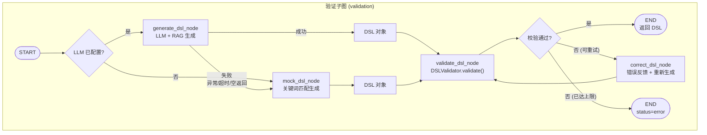
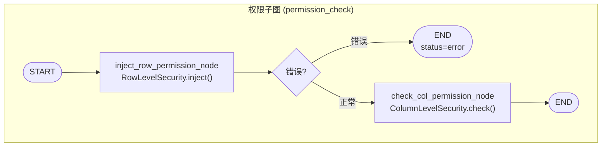
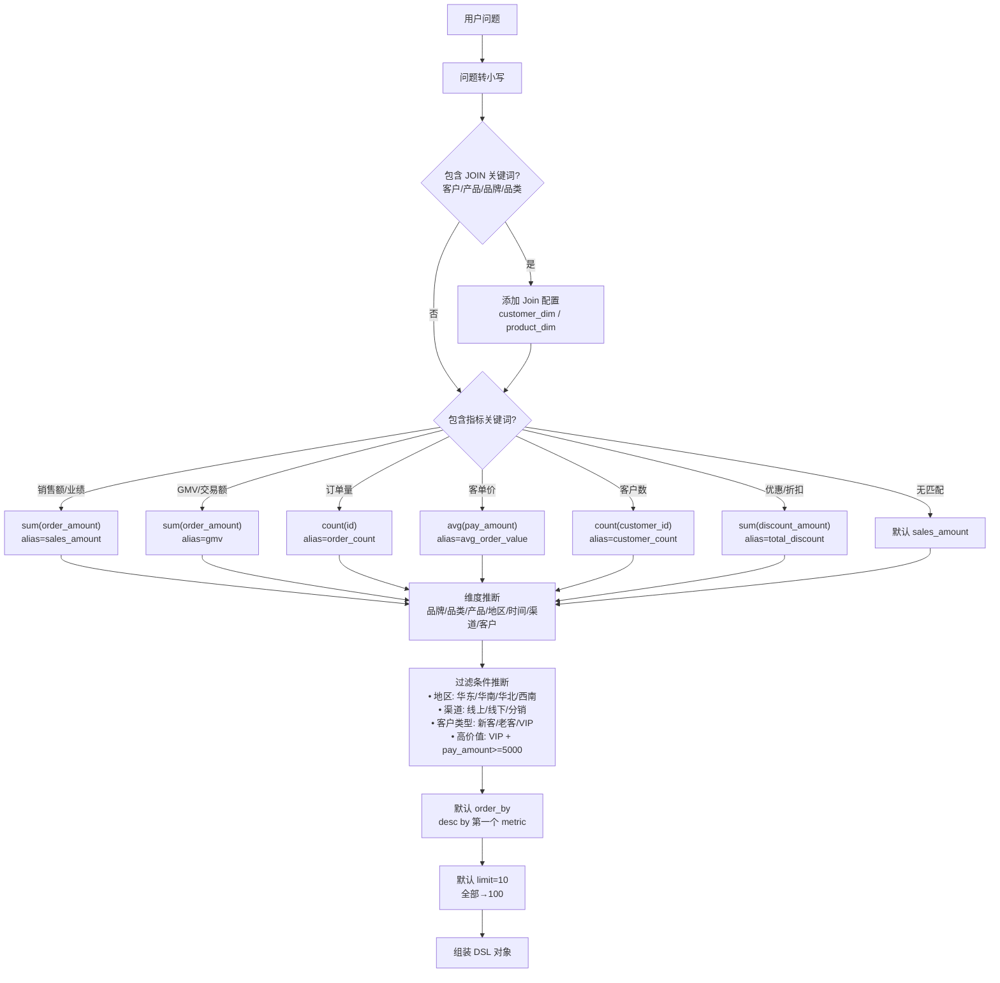
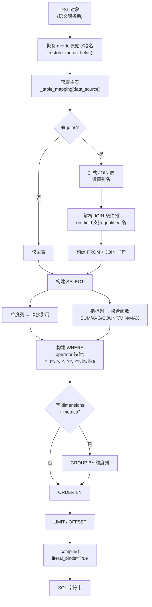
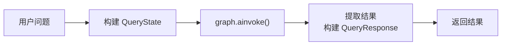
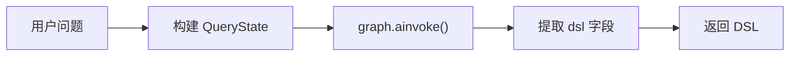
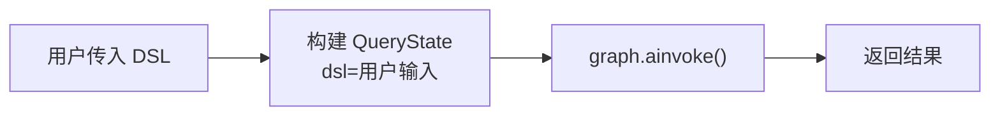
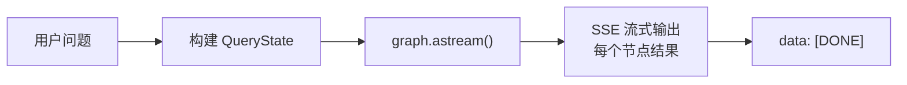
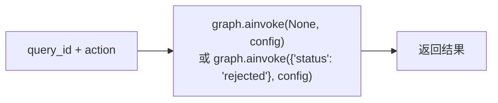
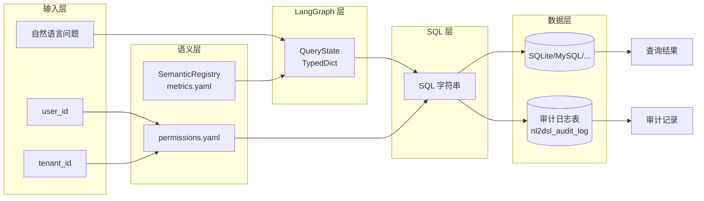

# NL2DSL 查询完整流程图

本文档描述用户自然语言查询从请求到结果返回的完整处理链路，基于 LangGraph StateGraph 架构。

---

## 一、顶层架构概览

```
用户请求 → API 层 → LangGraph StateGraph → 审计日志 → 返回响应
              ↓
         ┌──────────────────────────────────────────────┐
         │  clarification → validation 子图 →           │
         │  permission_check 子图 → resolve_semantic →  │
         │  build_sql → scan_sql → sandbox_check →      │
         │  [human_review] → execute_sql → END           │
         └──────────────────────────────────────────────┘
```

---

## 二、主查询链路详细流程图 (`POST /api/v1/query`)


---

## 三、各阶段状态码与异常映射表

| 阶段 | 状态/异常类型 | Error Code | HTTP Status | 触发场景 |
|------|-------------|-----------|-------------|---------|
| 歧义澄清 | `status=clarification` | — | 200 | 检测到时间缺失/指标歧义/维度歧义 |
| Sandbox 警告 | `status=warning` | — | 200 | 扫描行数超限 / 执行时间超限 / 缺少 WHERE 条件 |
| DSL 生成 | ValidationError | VALIDATION_ERROR | 400 | 验证子图重试耗尽 |
| DSL 校验 | ValidationError | VALIDATION_ERROR | 400 | 数据源/指标/维度不存在 |
| 行级权限 | — | — | — | 无权限配置则直通 |
| 列级权限 | PermissionError | PERMISSION_DENIED | 403 | 访问敏感字段 |
| 语义解析 | SemanticError | SEMANTIC_ERROR | 400 | 指标未定义 |
| SQL 构建 | ValidationError | VALIDATION_ERROR | 400 | 表不存在 / 列不存在 / 非法表达式 |
| SQL 扫描 | ValidationError | VALIDATION_ERROR | 400 | 检测到危险 SQL 模式 |
| SQL 执行 | Exception | INTERNAL_ERROR | 500 | 数据库执行失败 |
| 人工审核 | `status=pending_review` | — | 200 | 沙箱检测风险，等待人工确认 |
| 审计查询 | NotFoundError | NOT_FOUND | 404 | 审计记录不存在 |

---

## 四、StateGraph 节点详解

### 4.1 节点清单

| 节点 | 所在文件 | 说明 |
|------|---------|------|
| `clarification` | `builder.py` | 歧义检测，有歧义直接 END |
| `validation` (子图) | `subgraphs.py` | DSL 生成 + 校验 + 修正循环 |
| `permission_check` (子图) | `subgraphs.py` | 行级权限注入 + 列级权限检查 |
| `resolve_semantic` | `builder.py` | 指标展开为 SQL 表达式 |
| `build_sql` | `builder.py` | SQLAlchemy Core 构建 SQL |
| `scan_sql` | `builder.py` | SQL 安全扫描 |
| `sandbox_check` | `builder.py` | 预执行安全检测 |
| `human_review` | `builder.py` | 人工审核标记（可中断） |
| `execute_sql` | `builder.py` | 数据库执行 |
| `simplify_dsl` | `builder.py` | 简化 DSL 后重试 |

### 4.2 条件路由

| 路由函数 | 判断条件 | 分支 |
|---------|---------|------|
| `route_after_clarification` | `ambiguities` 是否存在 | `clarification` → END / `continue` → validation |
| `route_llm_availability` | `llm_client` 是否配置 | `llm` → generate_dsl / `mock` → mock_dsl |
| `route_after_validate` | 校验结果 + 重试次数 | `ok` → END / `retry` → correct_dsl / `error` → END |
| `detect_complexity` | joins / metrics / dimensions 数量 | `simple` / `complex` → scan_sql |
| `route_after_sandbox` | `sandbox_result.passed` | `review` → human_review / `execute` → execute_sql |
| `route_after_execute` | 执行结果 + 重试次数 | `retry` → simplify_dsl / `end` → END |
| `route_on_error` | `error_code` 是否致命 | `end` → END / `continue` → 尝试恢复 |

---

## 五、验证子图内部流程



**关键设计**: LLM 失败不 fallback 到 mock，而是重试修正。mock 只在 LLM 未配置时使用。

---

## 六、权限子图内部流程



---

## 七、Mock DSL 生成逻辑



---

## 八、SQL 构建阶段内部流程



---

## 九、辅助接口流程

### 9.1 `POST /api/v1/query` — 自然语言查询



### 9.2 `POST /api/v1/query/dsl` — 仅生成 DSL



### 9.3 `POST /api/v1/query/execute` — 直接执行 DSL



### 9.4 `POST /api/v1/query/stream` — 流式查询



### 9.5 `POST /api/v1/query/resume` — 恢复中断流程



---

## 十、审计 Trace 结构

每条查询的 `trace` 数组由各节点通过 `Annotated[list[dict], add_to_list]` reducer 自动累积：

```json
[
  {
    "step": "clarification",
    "status": "success",
    "items_count": 0
  },
  {
    "step": "mock_dsl",
    "status": "success",
    "source": "mock"
  },
  {
    "step": "validate_dsl",
    "status": "success"
  },
  {
    "step": "inject_row_permission",
    "status": "success"
  },
  {
    "step": "check_col_permission",
    "status": "success"
  },
  {
    "step": "resolve_semantic",
    "status": "success"
  },
  {
    "step": "build_sql",
    "status": "success"
  },
  {
    "step": "scan_sql",
    "status": "success"
  },
  {
    "step": "sandbox_check",
    "status": "success",
    "risks": []
  },
  {
    "step": "execute_sql",
    "status": "success",
    "rows_returned": 10
  }
]
```

---

## 十一、数据流图



---

## 十二、关键设计决策

1. **LangGraph StateGraph**: 用 StateGraph 建模查询管道，获得条件分支、检查点、流式输出、子图封装、LangSmith 追踪等原生能力。

2. **LLM 只生成 DSL 不生成 SQL**：DSL 是结构化 JSON，可校验、可修正、可做权限控制；SQL 是自由文本，出错后难以定位。

3. **LLM 路径与 Mock 路径独立**：LLM 未配置时使用 Mock（开发环境），LLM 配置正常时只走 LLM。LLM 调用失败时不给出低质量 Mock 结果，而是明确报错。

4. **验证子图内循环修正**：DSL 验证失败时，correct_dsl_node 将错误信息反馈给 LLM 重新生成，最多重试 3 次。

5. **歧义检测前置（Clarification）**：在 DSL 生成前检测用户问题的歧义（时间缺失、指标/维度歧义），返回澄清问题而非猜测，降低错误生成概率。

6. **Sandbox 预执行检查**：在正式执行 SQL 前运行 EXPLAIN + LIMIT 预览，检测全表扫描、执行超时、缺少 WHERE 等风险，拦截危险查询。

7. **语义层隔离业务与物理模型**：指标/维度通过 YAML 注册，LLM 只使用语义名，SQL 构建阶段再展开为物理列。

8. **SQL 安全扫描白名单模式**：禁止一切非 SELECT 操作（DML/DDL/注释/UNION/多语句）。

9. **行级权限自动注入**：在 DSL 编译为 SQL 之前注入过滤条件，确保用户只能看到授权数据。

10. **统一错误处理**: `@with_error_handler` 装饰器捕获所有节点异常，转换为标准错误状态（status=error, error_code, trace）。
