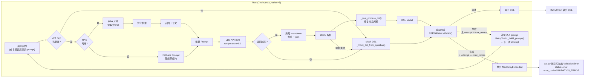
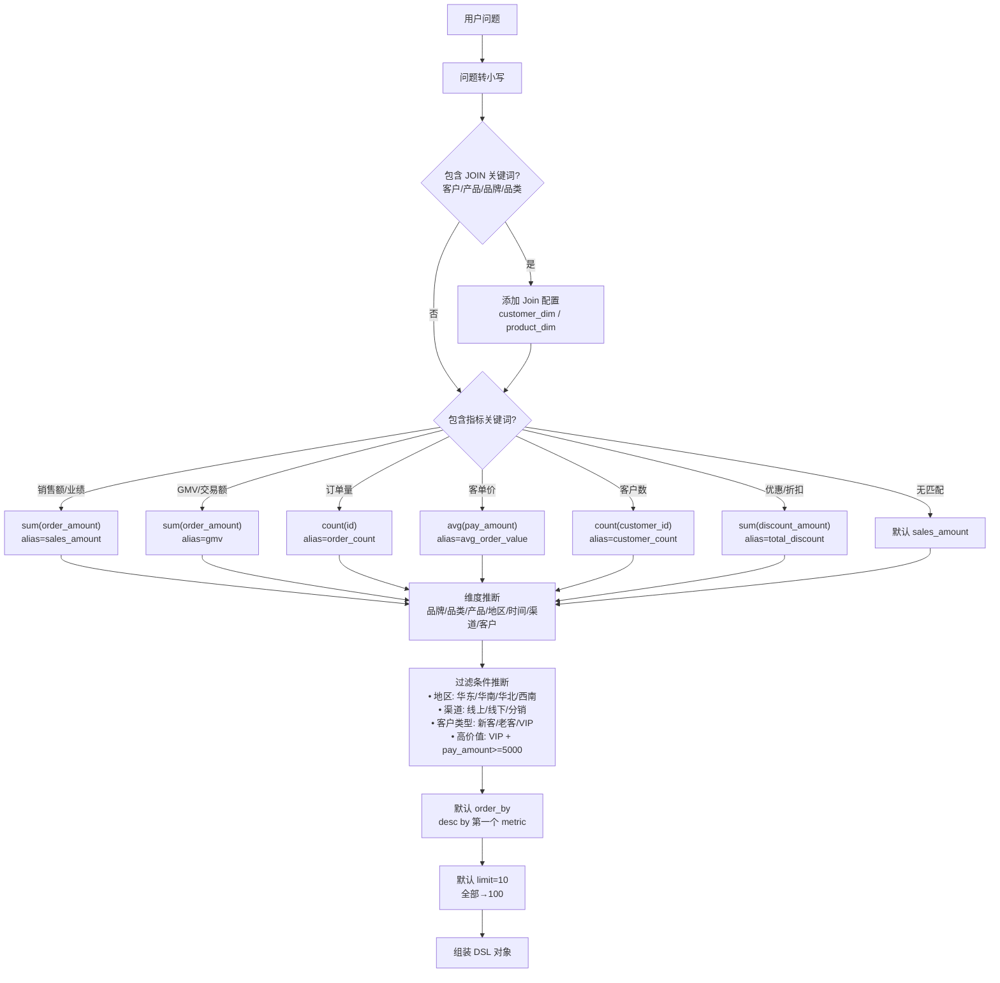
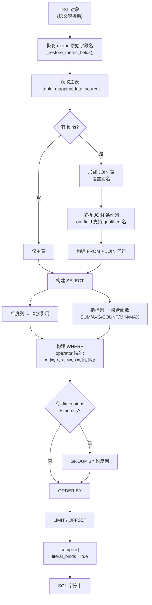
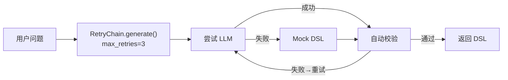
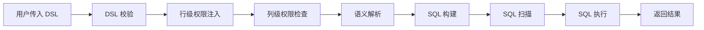
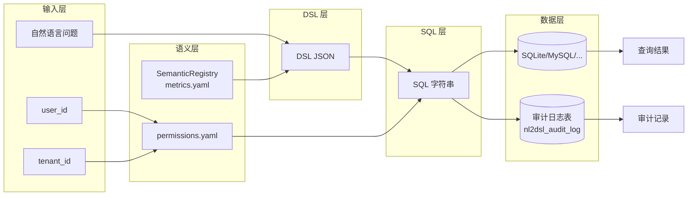

# NL2DSL 查询完整流程图

本文档描述用户自然语言查询从请求到结果返回的完整处理链路，包含每个处理节点和分支判断。

---

## 一、顶层架构概览

```
┌─────────────┐     ┌─────────────┐     ┌─────────────┐     ┌─────────────┐     ┌─────────────┐
│   用户请求   │────▶│  歧义澄清   │────▶│  DSL 生成   │────▶│  校验与权限  │────▶│ SQL 编译执行 │
│  (自然语言)  │     │(Clarification)│   │(RetryChain) │     │  语义解析   │     │  Sandbox   │
└─────────────┘     └─────────────┘     └─────────────┘     └─────────────┘     └─────────────┘
```

---

## 二、主查询链路详细流程图 (`POST /api/v1/query`)

```mermaid
flowchart TD
    START([用户发起 POST /api/v1/query]) --> INIT["1. 初始化<br/>生成 query_id<br/>开始计时<br/>初始化 trace 数组"]

    INIT --> CLARIFY{"2. 歧义澄清检查<br/>ClarificationDetector.detect()<br/>• 时间缺失<br/>• 指标歧义<br/>• 维度歧义<br/>• 比较基准歧义"}

    CLARIFY -->|"发现歧义"| RECORD_CLARIFY["记录 trace: clarification<br/>返回 clarification 响应"]
    RECORD_CLARIFY --> RESP_CLARIFY["返回 QueryResponse<br/>status=clarification<br/>含 clarification 字段"]
    RESP_CLARIFY --> END_CLARIFY([结束])

    CLARIFY -->|"无歧义"| DSL_GEN{"3. DSL 生成阶段<br/>RetryChain.generate()<br/>max_retries=3"}

    %% DSL 生成分支 (RetryChain 包装)
    DSL_GEN -->|"attempt 1"| GEN_ATTEMPT["3a. 生成尝试"]

    GEN_ATTEMPT -->|"API Key 已配置"| LLM_TRY["尝试 LLM 生成<br/>_llm_generate_dsl()"]
    GEN_ATTEMPT -->|"API Key 未配置"| MOCK["Mock DSL 生成<br/>_mock_dsl_from_question()"]

    LLM_TRY --> RAG_CHECK{"RAG 可用?"}
    RAG_CHECK -->|"是"| RAG_PROMPT["RAG 构建 Prompt<br/>• jieba 分词提取关键词<br/>• 混合检索: 语义向量 + 关键词匹配<br/>• 从 schema/metrics/history/terms 召回上下文"]
    RAG_CHECK -->|"否"| FALLBACK_PROMPT["Fallback Prompt<br/>硬编码表结构 + 指标 + 维度"]

    RAG_PROMPT --> LLM_CALL["调用 LLM API<br/>(OpenAI SDK, DashScope)"]
    FALLBACK_PROMPT --> LLM_CALL

    LLM_CALL --> LLM_OK{"LLM 返回成功?"}
    LLM_OK -->|"是"| PARSE["解析 JSON + 后处理<br/>_post_process_dsl()<br/>• 修正 data_source<br/>• 补充默认 metrics<br/>• 规范化 func 包裹<br/>• 补充默认 dimensions<br/>• 修正 limit / offset<br/>• 补充默认 order_by<br/>• 校验 operator 合法性"]
    LLM_OK -->|"否 (异常/超时/空返回)"| MOCK

    PARSE --> PARSE_OK{"JSON 解析成功?"}
    PARSE_OK -->|"是"| DSL_READY["DSL Model 对象"]
    PARSE_OK -->|"否"| MOCK

    MOCK["Mock DSL 生成<br/>• 关键词匹配指标<br/>• JOIN 意图检测 (客户/产品)<br/>• 模糊语义识别 (高价值→VIP)<br/>• 维度/过滤/排序自动推断"]
    MOCK --> DSL_READY

    DSL_READY --> VALIDATE_RETRY["自动校验<br/>DSLValidator.validate()"]
    VALIDATE_RETRY --> VALID_OK_RETRY{"校验通过?"}
    VALID_OK_RETRY -->|"否"| FEEDBACK["将错误注入 prompt<br/>RetryChain._build_prompt()<br/>进入下一次 attempt"]
    FEEDBACK --> GEN_ATTEMPT
    VALID_OK_RETRY -->|"是 (或达到 max_retries)"| DSL_DONE["DSL 生成完成"]

    DSL_DONE --> RECORD_DSL["记录 trace: dsl_generate<br/>标记 llm_used=true/false"]

    %% DSL 校验 (RetryChain 内部已做，此处为防御性校验)
    RECORD_DSL --> VALIDATE["4. DSL 校验<br/>DSLValidator.validate()<br/>• data_source 存在性<br/>• metrics alias 已注册<br/>• dimensions 已注册<br/>• 至少指定 metric 或 dimension"]
    VALIDATE --> VALID_OK{"校验通过?"}
    VALID_OK -->|"否"| ERR_VALIDATE["异常: ValidationError<br/>error_code=VALIDATION_ERROR<br/>status_code=400"]
    VALID_OK -->|"是"| RECORD_VAL["记录 trace: validate"]

    %% 行级权限
    RECORD_VAL --> RLS["4. 行级权限注入<br/>RowLevelSecurity.inject()<br/>• 按 user_id 查找权限配置<br/>• 注入 row_filters<br/>• 注入 tenant_id 隔离"]
    RLS --> RECORD_RLS["记录 trace: row_permission_inject"]

    %% 列级权限
    RECORD_RLS --> CLS["5. 列级权限检查<br/>ColumnLevelSecurity.check()<br/>• 检查 dimensions 是否含敏感字段<br/>• 命中敏感字段即拒绝"]
    CLS --> CLS_OK{"检查通过?"}
    CLS_OK -->|"否"| ERR_CLS["异常: PermissionError<br/>error_code=PERMISSION_DENIED<br/>status_code=403"]
    CLS_OK -->|"是"| RECORD_CLS["记录 trace: column_permission_check"]

    %% 语义解析
    RECORD_CLS --> SEMANTIC["6. 语义解析<br/>SemanticResolver.resolve()<br/>• 指标展开: alias → SQL expr<br/>  (sales_amount → SUM(pay_amount))<br/>• 过滤器维度展开: field → column<br/>• value_map 值映射转换"]
    SEMANTIC --> SEM_OK{"解析成功?"}
    SEM_OK -->|"否 (指标未定义)"| ERR_SEM["异常: SemanticError<br/>error_code=SEMANTIC_ERROR<br/>status_code=400"]
    SEM_OK -->|"是"| RECORD_SEM["记录 trace: semantic_resolve"]

    %% SQL 构建
    RECORD_SEM --> BUILD_SQL["7. SQL 构建<br/>SQLBuilder.build()<br/>• 恢复 metric 原始字段名<br/>• 解析主表 + JOIN 表<br/>• 构建 SELECT (维度 + 聚合)<br/>• 构建 WHERE (含 operator 映射)<br/>• 构建 GROUP BY<br/>• 构建 ORDER BY (支持 metric alias)<br/>• 构建 LIMIT / OFFSET<br/>• 编译为 SQL 字符串"]
    BUILD_SQL --> BUILD_OK{"构建成功?"}
    BUILD_OK -->|"否"| ERR_BUILD["异常: ValidationError<br/>error_code=VALIDATION_ERROR<br/>status_code=400"]
    BUILD_OK -->|"是"| RECORD_BUILD["记录 trace: sql_build"]

    %% SQL 扫描
    RECORD_BUILD --> SCAN["9. SQL 安全扫描<br/>SQLScanner.scan()<br/>• 检测 DELETE/UPDATE/DROP/...<br/>• 检测块注释 /* */<br/>• 检测行注释 --<br/>• 检测 UNION<br/>• 检测多语句 ;"]
    SCAN --> SCAN_OK{"扫描通过?"}
    SCAN_OK -->|"否"| ERR_SCAN["异常: ValidationError<br/>error_code=VALIDATION_ERROR<br/>status_code=400"]
    SCAN_OK -->|"是"| RECORD_SCAN["记录 trace: sql_scan"]

    %% Sandbox 检查
    RECORD_SCAN --> SANDBOX["10. Sandbox 预执行检查<br/>QuerySandbox.check()<br/>• EXPLAIN QUERY PLAN 估算扫描行数<br/>• LIMIT 10 预览执行时间<br/>• 检测缺少 WHERE 条件"]
    SANDBOX --> SANDBOX_OK{"检查通过?"}
    SANDBOX_OK -->|"否 (有风险)"| RECORD_SANDBOX_WARN["记录 trace: sandbox<br/>passed=false, risks=[...]"]
    RECORD_SANDBOX_WARN --> RESP_WARN["返回 QueryResponse<br/>status=warning<br/>sql 返回但不执行"]
    RESP_WARN --> AUDIT_WARN["审计日志记录<br/>status=warning<br/>含 risks"]
    AUDIT_WARN --> END_WARN([结束])

    SANDBOX_OK -->|"是"| RECORD_SANDBOX["记录 trace: sandbox<br/>passed=true, risks=[]"]

    %% SQL 执行
    RECORD_SANDBOX --> EXEC["11. SQL 执行<br/>sqlalchemy engine.execute()<br/>转换为 dict list"]
    EXEC --> EXEC_OK{"执行成功?"}
    EXEC_OK -->|"否"| ERR_EXEC["异常: 通用 Exception<br/>error_code=INTERNAL_ERROR<br/>status_code=500"]
    EXEC_OK -->|"是"| RECORD_EXEC["记录 trace: sql_execute<br/>rows_returned=N"]

    %% 成功响应
    RECORD_EXEC --> AUDIT_OK["12. 审计日志记录<br/>AuditLogger.log()<br/>status=success<br/>含完整 trace"]
    AUDIT_OK --> RESP_OK["返回 QueryResponse<br/>status=success<br/>data + dsl + sql + execution_time_ms"]
    RESP_OK --> END_OK([结束])

    %% 异常汇聚
    ERR_VALIDATE --> AUDIT_ERR
    ERR_CLS --> AUDIT_ERR
    ERR_SEM --> AUDIT_ERR
    ERR_BUILD --> AUDIT_ERR
    ERR_SCAN --> AUDIT_ERR
    ERR_EXEC --> AUDIT_ERR

    AUDIT_ERR["审计日志记录<br/>status=error<br/>含 trace + error_code + error_message"] --> RESP_ERR["返回 JSONResponse<br/>status=error + error_code + message"]
    RESP_ERR --> END_ERR([结束])
```



---

## 三、各阶段状态码与异常映射表

| 阶段 | 状态/异常类型 | Error Code | HTTP Status | 触发场景 |
|------|-------------|-----------|-------------|---------|
| 歧义澄清 | `status=clarification` | — | 200 | 检测到时间缺失/指标歧义/维度歧义/比较基准歧义 |
| Sandbox 警告 | `status=warning` | — | 200 | 扫描行数超限 / 执行时间超限 / 缺少 WHERE 条件 |
| DSL 生成 | MaxRetryExceeded → ValidationError | VALIDATION_ERROR | 400 | RetryChain 3 次重试后仍验证失败 |
| DSL 生成 | LLMError | LLM_ERROR | 502 | LLM API 调用失败（RetryChain 内部捕获） |
| DSL 校验 | ValidationError | VALIDATION_ERROR | 400 | 数据源/指标/维度不存在 |
| 行级权限 | — | — | — | 无权限配置则直通 |
| 列级权限 | PermissionError | PERMISSION_DENIED | 403 | 访问敏感字段 |
| 语义解析 | SemanticError | SEMANTIC_ERROR | 400 | 指标未定义 |
| SQL 构建 | ValidationError | VALIDATION_ERROR | 400 | 表不存在 / 列不存在 / 非法表达式 |
| SQL 扫描 | ValidationError | VALIDATION_ERROR | 400 | 检测到危险 SQL 模式 |
| SQL 执行 | Exception | INTERNAL_ERROR | 500 | 数据库执行失败 |
| 审计查询 | NotFoundError | NOT_FOUND | 404 | 审计记录不存在 |

---

## 四、DSL 生成阶段内部流程

### 4.1 LLM + RetryChain 生成链路



### 4.2 Mock DSL 生成逻辑



---

## 五、SQL 构建阶段内部流程



---

## 六、辅助接口流程

### 6.1 `POST /api/v1/query/dsl` — 仅生成 DSL



包含: DSL 生成 + RetryChain 自动校验 + 重试。跳过: 权限注入、语义解析、SQL 构建/扫描/执行、审计记录。

### 6.2 `POST /api/v1/query/execute` — 直接执行 DSL



跳过: DSL 生成阶段。从用户提供的 DSL 直接开始校验执行。

---

## 七、审计 Trace 结构

每条查询的 `trace` 数组记录各阶段耗时和中间状态：

```json
[
  {
    "step": "clarification",
    "status": "success",
    "duration_ms": 5,
    "output": {
      "items": [
        { "type": "time_missing", "question": "请确认时间范围", "options": ["本月", "上月", "最近7天"] }
      ]
    }
  },
  {
    "step": "dsl_generate",
    "status": "success",
    "duration_ms": 1250,
    "output": {
      "dsl": { ... },
      "llm_used": true
    }
  },
  {
    "step": "validate",
    "status": "success",
    "duration_ms": 2
  },
  {
    "step": "row_permission_inject",
    "status": "success",
    "duration_ms": 1,
    "output": { "dsl": { ... } }
  },
  {
    "step": "column_permission_check",
    "status": "success",
    "duration_ms": 1
  },
  {
    "step": "semantic_resolve",
    "status": "success",
    "duration_ms": 3,
    "output": { "dsl": { ... } }
  },
  {
    "step": "sql_build",
    "status": "success",
    "duration_ms": 15,
    "output": { "sql": "SELECT ..." }
  },
  {
    "step": "sql_scan",
    "status": "success",
    "duration_ms": 1
  },
  {
    "step": "sandbox",
    "status": "success",
    "duration_ms": 12,
    "output": {
      "passed": true,
      "risks": [],
      "estimated_rows": 1000,
      "execution_time_ms": 8.5
    }
  },
  {
    "step": "sql_execute",
    "status": "success",
    "duration_ms": 8,
    "output": { "rows_returned": 10 }
  }
]
```

---

## 八、数据流图



---

## 九、关键设计决策

1. **LLM 只生成 DSL 不生成 SQL**：DSL 是结构化 JSON，可校验、可修正、可做权限控制；SQL 是自由文本，出错后难以定位。

2. **LLM 失败自动回退 Mock**：保证系统在无 API Key 或 LLM 服务异常时仍可工作。

3. **RetryChain 错误反馈重试**：DSL 验证失败时，将错误信息注入 prompt 让 LLM 自我修正，最多重试 3 次。Mock 生成器不会触发重试（关键词匹配是确定性的）。

4. **歧义检测前置（Clarification）**：在 DSL 生成前检测用户问题的歧义（时间缺失、指标/维度歧义、比较基准不明），返回澄清问题而非猜测，降低错误生成概率。

5. **Sandbox 预执行检查**：在正式执行 SQL 前运行 EXPLAIN + LIMIT 预览，检测全表扫描、执行超时、缺少 WHERE 等风险，拦截危险查询。

6. **语义层隔离业务与物理模型**：指标/维度通过 YAML 注册，LLM 只使用语义名，SQL 构建阶段再展开为物理列。

7. **RAG 混合检索**：jieba 关键词分割 + BGE 向量语义检索，提升上下文召回精度。

8. **SQL 安全扫描白名单模式**：禁止一切非 SELECT 操作（DML/DDL/注释/UNION/多语句）。

9. **行级权限自动注入**：在 DSL 编译为 SQL 之前注入过滤条件，确保用户只能看到授权数据。
